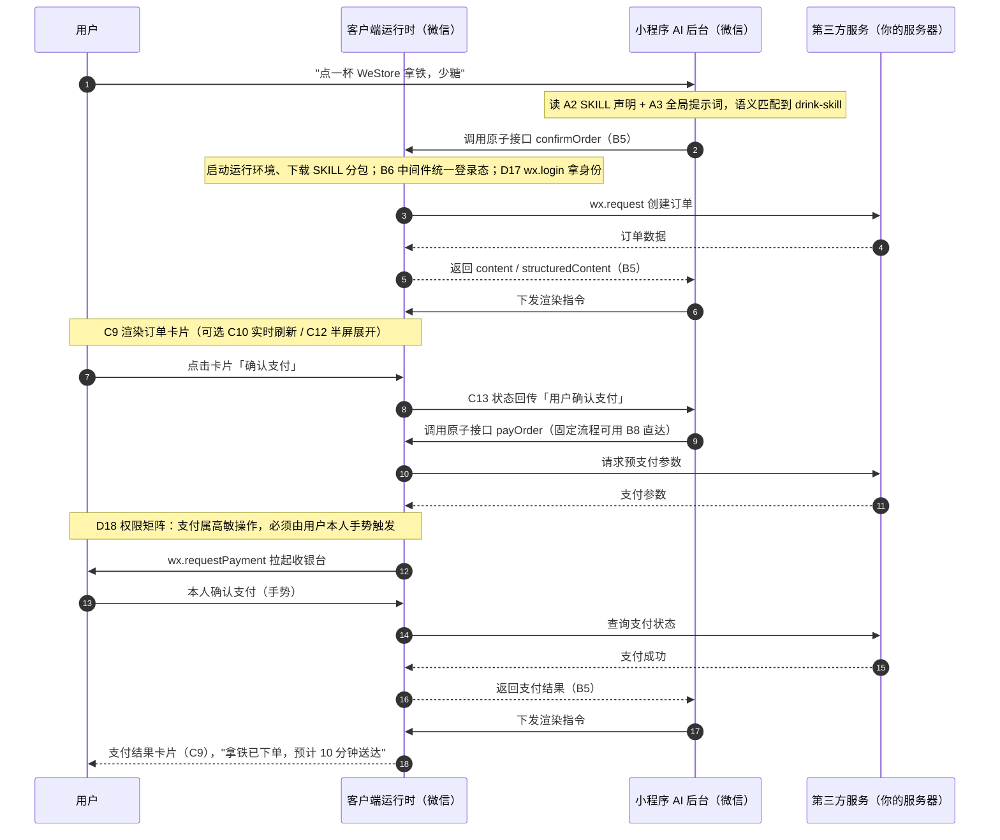

# 微信小程序 AI 能力列表（开发者视角）

> **这份文档回答三个问题**：微信「小程序 AI 开发模式」给开发者提供了哪些能力？每个能力解决什么问题？怎么接入？
>
> **来源与时效**：全部内容依据官方文档本地镜像 [`docs/wechat-ai-docs/`](../wechat-ai-docs/README.md)（快照时间 2026-07-21，能力处于 **beta 内测**）整理，只收**官方明示、开发者可接入**的能力；黑盒反推发现见附录 B。
>
> **建议读法**：第 1 章先花 1 分钟搞懂三个基础词 → 第 2 章用一个「点拿铁」故事看能力全景（2.1 空间视角 + 2.2 时序视角）→ 第 3 章总览表按需定位 → 第 4 章分组查详情。
>
> ⚠️ **内测提醒**：当前未开放代码提审。请勿将此模式相关代码合入正式版本提交审核，以免影响正常版本发布。

---

## 1. 先懂三个基础概念（1 分钟）

官方文档里有三个高频词，先用「餐厅点单」类比一遍：

| 概念 | 官方定义（通俗版） | 餐厅类比 |
|---|---|---|
| **SKILL** | 完成一个场景任务的完整能力封装，由「业务说明 + 能力声明 + 代码实现」组成 | 整个「点单服务」：菜单、流程、后厨全套 |
| **原子接口** | 最小执行单元，封装单一业务功能，有标准入参出参，跑在微信客户端的隔离 JS 环境里 | 后厨的一道工序：「下单」「查订单」「发起支付」 |
| **原子组件** | 原子接口返回数据的可视化卡片，渲染在对话流里 | 端上桌的摆盘：订单卡片、支付结果卡片 |

**一句话总纲**：你把小程序功能封装成 SKILL → 用户对小程序 AI 说话 → AI 调用你的原子接口干活 → 干完的结果用原子组件画成卡片给用户看。

三个参与方的分工（官方《运行机制》口径）：

- **客户端运行时**（微信客户端）：执行你的原子接口代码、渲染原子组件卡片；
- **小程序 AI 后台**（微信侧的大脑）：根据你的 SKILL 声明 + 用户请求，决定调用哪个接口、何时渲染卡片；
- **第三方服务**（你的服务器）：原子接口内部通过 `wx.request` / 云开发与之交互，完成真正的业务数据读写。

---

## 2. 一杯拿铁的旅程

本章用同一个「点拿铁」故事讲两遍：**2.1 全景图**看哪些能力在哪个环节出场（空间视角），**2.2 时序图**看消息按时间怎么走（时间视角），两图互补。编号贯穿第 3 章总览表与第 4 章详情。

### 2.1 能力全景图

把 24 项能力放进一次完整对话里，看它们各自在哪个环节出场：

```
用户："点一杯 WeStore 拿铁，少糖"
  │
  │ ① 接入侧：AI 后台读你的声明，认识你的小程序
  ├─ A2 SKILL 声明 ──┐
  ├─ A3 全局提示词 ───┼─► AI 知道"这家店会点单"，语义匹配到 drink-skill
  │                  │    （全都匹配不上时 → E19 知识库兜底答 FAQ）
  │
  │ ② 调用侧：AI 决定执行动作
  ├─ B5 原子接口 confirmOrder 被调用（入参由 AI 按声明填写）
  │    ├─ B6 中间件：统一登录态、统一上报
  │    ├─ B7 多模态：用户发的是图片/文件？接口也能收到
  │    └─ D17 身份复用：wx.login 拿到与小程序一致的身份
  │         └─ 你的服务器（D 权限矩阵内的 wx.request）创建订单
  │
  │ ③ 呈现侧：结果变成看得见的卡片
  ├─ C9 原子组件：订单信息渲染成 GUI 卡片
  │    ├─ C10 实时动态：外卖进度每 30 秒自动刷新
  │    ├─ C12 半屏展开：列表太长？卡片半屏化
  │    └─ C11 过期态：订单失效后旧卡片盖蒙层防误点
  │
  │ ④ 用户在卡片/页面上操作
  ├─ C13 状态回传：用户点了"少糖"，模型立刻知道
  ├─ C16 页面接力：点击卡片进入小程序页完成支付（Handoff）
  │    └─ 支付是高敏操作 → D18 权限矩阵要求用户手势确认
  ├─ C15 半屏页面：补充地址/选规格，不离开对话
  │    └─ C14 上行消息：页面代用户发"已完成"，流程回到对话
  │
  │ ⑤ 开发期（不在运行链上，全程可用）
  └─ F22 调试 · F21 评测 · F23 生成辅助 · F24 观测平台
```

### 2.2 主流程时序图

主线忠实官方《运行机制》的点拿铁流程，消息上标注出场的能力编号：



**主线之外的三个变体出口**（按需替换或叠加）：

- **C15 半屏页面**：需要补充信息（选规格/地址）时从卡片拉起半屏页，操作完经 C14 上行消息自动回到对话；
- **C16 页面接力（Handoff）**：复杂流程（选规格 → 填地址 → 支付）不经对话往返——AI 出小程序卡片，用户点击进页一次做完；
- **E19 知识库**：用户问题与所有 SKILL 都不匹配时，检索知识库兜底作答。

---

## 3. 能力总览表（24 项）

> 「状态」列决定当前能否使用；能力名前的编号是第 4 章详情的锚点，也用于第 2 章两图的标注。

| 能力 | 面向 | 解决什么问题 | 状态 |
|---|---|---|---|
| A1 · 开发模式申请 | 开发者 | 入场券，全部能力的前提 | 内测，需申请 |
| A2 · SKILL 封装与声明 | 开发者 | 让 AI 知道你会什么 | 可用 |
| A3 · 全局提示词 | 开发者 | 多技能关系有处安放，模型选得更准 | 可用 |
| A4 · 页面元数据声明 | 开发者 | 存量页面零改造成为可推荐资产 | 可用 |
| B5 · 原子接口 | 用户 | 把一句话变成真实业务动作 | 可用 |
| B6 · 中间件机制 | 开发者 | 公共逻辑写一次处处生效 | 可用 |
| B7 · 多模态输入 | 用户 | 图片/文件类请求也能被承接 | 可用 |
| B8 · apiCalls | 用户 | 固定流程更快更稳 | 可用 |
| C9 · 原子组件卡片 | 用户 | 结构化结果变卡片，不用读文字墙 | 可用 |
| C10 · 实时动态组件 | 用户 | 进度自动更新，不用反复追问 | 需单独审核 |
| C11 · 卡片过期态 | 用户 | 失效内容盖蒙层，杜绝误点 | 可用 |
| C12 · 半屏原子组件 | 用户 | 长列表放得下，点展开看更多 | 可用 |
| C13 · 交互状态回传 | 用户 | 卡片上的选择即时生效，AI 不答非所问 | 可用 |
| C14 · 上行消息 | 用户 | 页面操作自动回流对话 | 可用 |
| C15 · 半屏页面 | 用户 | 补信息不跳走，上下文不丢 | 可用，**暂不支持调试** |
| C16 · 页面接力 Handoff | 用户 | 重操作进页面一次做完 | 可用 |
| D17 · 登录态复用 | 用户 | 沿用既有登录，无需重新授权 | 可用 |
| D18 · API 权限矩阵 | 用户 | 高敏操作必有本人手势，AI 不能替你花钱（亦是平台合规底线） | 自动 |
| E19 · 知识库 | 平台 | 长尾知识不写代码也能问答 | 仅开发/体验版 |
| E20 · 服务直达 | 平台 | 未接入的页面也有 AI 流量入口 | 可用 |
| F21 · 评测工具 | 开发者 | 效果量化成分数，优化有靶子（兼平台门禁：≥60 才被调用） | 自测可用 |
| F22 · 调试与真机预览 | 开发者 | 黑盒调用链可单步、可复现 | 可用，真机仅 iOS |
| F23 · 生成/校验 Skills | 开发者 | 接入成本降到「AI 生成 + 校验」 | 可用 |
| F24 · 观测平台 | 开发者 | 线上问题可定位、可重放 | 可用 |

---

## 4. 分组详情

每项按四段展开：**是什么（面向用户的条目附「用户看到」）→ 解决什么问题 → 如何接入（有依赖的条目标「前置」）→ 限制与易错点**；出处以条目末尾小注给出。示例统一采用官方文档的 `getWeather`（天气查询）与 WeStoreCafe（咖啡点单）案例。

### A. 接入与声明——让 AI 认识你的小程序

#### A1 开发模式申请

- **是什么**：小程序 AI 开发模式的开通入口，整个能力体系的前提。
- **解决什么问题**：内测阶段所有能力都要求先申请开通「开发模式」。
- **如何接入**：二选一——网页端「微信公众平台 → 基础功能 → AI 能力」，或小程序「微信开发者助手 → 管理 → 微信 AI管理」，在接入模式中选择「开发模式」申请。
- **限制与易错点**：内测期未开放代码提审，相关代码勿合入正式版。

*出处：[01-guide.md](../wechat-ai-docs/01-guide.md)*

#### A2 SKILL 封装与声明

- **是什么**：SKILL = `SKILL.md`（业务说明）+ `mcp.json`（能力声明）+ `index.js`（接口注册）+ `apis/`（接口实现）+ `components/`（组件实现），是交给平台的完整能力包。
- **解决什么问题**：AI 后台靠它理解「你的小程序会什么、怎么调」。没有 SKILL，AI 对你的业务一无所知。
- **如何接入**（三步）：
  1. `app.json` 增加 `agent.skills` 列表，每项声明 `name` / `description` / `path`；
  2. SKILL 放进**独立分包**（一个分包可放多个 SKILL），并全局开启按需注入 `"lazyCodeLoading": "requiredComponents"`；
  3. 按固定结构编写目录：

  ```
  skills/drink-skill/
  ├── SKILL.md          # 业务说明（给 AI 读的"说明书"）
  ├── mcp.json          # 原子接口的 schema 声明（给 AI 的"点菜单"）
  ├── index.js          # 注册所有原子接口
  ├── apis/             # 接口实现（建议目录）
  └── components/       # 组件实现（建议目录）
  ```

- **限制与易错点**：最多 **30 个** SKILL；`SKILL.md` ≤ **16000 字节**（单文件，不能引用其他 md）；`mcp.json` ≤ **24000 字符**（计算时除去 `outputSchema`、空格与换行）。

*出处：[02-integration.md](../wechat-ai-docs/02-integration.md)*

#### A3 全局提示词（AGENTS.md）

- **是什么**：一个小程序级别的说明文件，描述服务范围、背景知识、回答风格，以及多个 SKILL 之间的关联关系。
- **解决什么问题**：单个 `SKILL.md` 只说单个技能；跨技能的信息（「点单和查物流是同一家店的两项服务」）需要一个全局位置，帮助模型选对 SKILL。
- **如何接入**：编写 `AGENTS.md`，在小程序配置的 `instruction` 字段指定路径（当前非必填）。
- **限制与易错点**：≤ **10000 字节**。

*出处：[02-integration.md](../wechat-ai-docs/02-integration.md)*

#### A4 页面元数据声明（page-meta.json）

- **是什么**：逐页面描述「这个页面是干什么的、需要什么参数」的声明文件。
- **解决什么问题**：这是 E20「服务直达」的数据源——AI 依据它判断何时把你的页面（以账号卡片形式）推给用户；同时页面配置质量会影响评测得分（见 F21）。
- **如何接入**：`app.json` 加 `"pageMetadata": "page-meta.json"`，然后逐页面填写：

  ```json
  [
    {
      "path": "pages/order/index?from=ai",
      "name": "订单页",
      "description": "展示订单详情与配送进度",
      "query": { "type": "object", "properties": { "orderId": { "type": "string" } } }
    }
  ]
  ```

- **限制与易错点**：≤ **8000 字节**；`path` 可带固定 query，`query` 字段为 JSON Schema 格式。

*出处：[02-integration.md](../wechat-ai-docs/02-integration.md)*

### B. 模型调用——让 AI 能执行你的业务

#### B5 原子接口

- **是什么**：最小执行单元。你声明入参出参 Schema，AI 生成参数调用它，它返回结果。整个体系的**核心能力**，其余能力大多围绕它展开。用户看到：无——只在对话里看到结果，接口本身不可见。
- **解决什么问题**：把「用户说想喝少糖拿铁」变成你服务器上一次真实的下单动作。
- **如何接入**：
  1. `mcp.json` 声明（AI 靠 `description` 决定选不选它，靠 `inputSchema.description` 决定怎么填参）：

  ```json
  {
    "apis": [{
      "name": "getWeather",
      "description": "获取指定城市的天气信息",
      "inputSchema": {
        "type": "object",
        "properties": { "city": { "type": "string", "description": "城市名称" } },
        "required": ["city"]
      },
      "outputSchema": { "type": "object", "properties": { "temperature": { "type": "number" } } },
      "_meta": { "ui": { "componentPath": "components/weather-card/index" } }
    }]
  }
  ```

  2. 实现并注册：

  ```js
  // apis/getWeather.js
  export async function getWeather({ city }) {
    const res = await wx.request({ url: 'https://api.example.com/weather', data: { city } })
    return {
      content: [{ type: 'text', text: `${city}今日 ${res.data.weather}，${res.data.temperature}°C` }],
      structuredContent: res.data,          // 给卡片渲染 + 给模型理解
      _meta: { lastQuery: city }            // 对模型不可见，只传给组件
    }
  }

  // index.js
  module.exports = { getWeather }
  ```

- **返回值语义**（重要，决定 AI 下一步行为）：

  | 字段 | 给谁看 | 说明 |
  |---|---|---|
  | `content` | 模型 | 事实 + 下一步动作（必填） |
  | `structuredContent` | 模型 + 卡片 | 结构化数据 |
  | `_meta` | 仅卡片 | 私有数据，模型不可见 |
  | `isError` | 框架 | `true` 时不渲染卡片，`content` 用于异常引导 |
  | `handoff` / `apiCalls` | 框架 | 见 C16 / B8 |

- **限制与易错点**：`content` / `structuredContent` / `_meta` 各 ≤ **200KB**；易错：模型生成的参数不保证正确，接口内必须自行校验（如 `drinkId` 是否存在）；强制出卡片可在 `content` 追加「接下来为用户展示 XXX UI 卡片」。

*出处：[02-integration.md](../wechat-ai-docs/02-integration.md)、写作规范见 [05-best-practices.md](../wechat-ai-docs/05-best-practices.md)*

#### B6 中间件机制

- **是什么**：多个原子接口共享的洋葱模型拦截层（`next()` 前是前置、后是后置）。
- **解决什么问题**：登录态获取、上报、错误监听这类每个接口都要做的公共逻辑，不用复制进每个接口。
- **如何接入**：

  ```js
  const skill = wx.modelContext.createSkill('skills/drink-skill')
  skill.use(async (ctx, next) => {
    ctx.loginState = await getLoginState()   // 前置
    try { await next() } catch (e) { throw e } // 后置/错误监听
  })
  skill.registerAPI('getWeather', getWeather)
  ```

- **限制与易错点**：整条链与接口执行**共享 300s 超时**；多个中间件按注册顺序成链。

*出处：[02-integration.md](../wechat-ai-docs/02-integration.md)*

#### B7 多模态输入

- **是什么**：用户在 AI 输入框上传的图片/文件，可以直接传给原子接口。用户看到：发出去的图/文件被 AI 理解并处理。
- **解决什么问题**：「识别这张小票帮我开票」「按这张图配色下单」这类需求。
- **如何接入**：在 `inputSchema` 对应字段标注 `"format": "image"` 或 `"format": "file"`，AI 会自动把用户上传内容传入该字段。
- **限制与易错点**：无需额外代码，纯声明生效。

*出处：[02-integration.md](../wechat-ai-docs/02-integration.md)*

#### B8 apiCalls 显式下一步

- **是什么**：原子接口返回值中显式指定「接下来调用哪个接口、传什么参数」。用户看到：无——固定流程的回复来得更快。
- **解决什么问题**：流程固定的场景（下单 → 必然查支付状态），跳过模型推理环节，省时延也更稳。
- **如何接入**：返回值加 `apiCalls: [{ name: 'payOrder', arguments: { orderId } }]`。
- **限制与易错点**：与 `content` 同级返回。

*出处：[02-integration.md](../wechat-ai-docs/02-integration.md)*

### C. 呈现——让结果变成看得见的界面

本组 8 项的内在逻辑：**卡片本体（C9-C12）→ 卡片上的交互（C13-C14）→ 跳出卡片（C15-C16）**。

#### C9 原子组件（GUI 卡片）

- **是什么**：渲染在对话流里的 GUI 卡片，由微信自研卡片渲染引擎 + glass-easel 框架渲染，编码方式与小程序自定义组件一致。用户看到：对话流中多了一张 GUI 卡片（订单、商品图、地图）。
- **解决什么问题**：纯文字回复展示不了订单、商品图、地图；卡片让结构化数据可视化。
- **如何接入**：
  1. `mcp.json` 的 `_meta.ui.componentPath` 指向组件路径；
  2. 组件用 `wx.modelContext.getContext/getViewContext` 拿渲染所需数据；
  3. 卡片标题栏右上角有进入小程序的入口，需在 `mcp.json` 的 `components` 里声明关联页面 `pagePath`（必填），可用 `setRelatedPageQuery` 动态设置 query。

- **限制与易错点**（卡片是"受限画布"）：
  - 高度：宽高比 **4:1 ~ 1:1** 之间；易错：高度在初始化时决定，之后不可再改；
  - 交互：仅支持 **tap 点击、Image load/error** 三种事件；
  - 联网：默认禁网络、云开发、定时器（要开需 C10 实时动态声明）；
  - 其他：不支持动画、不支持打开小程序、禁止 `overflow-y` 纵向滚动；
  - 内置组件仅 7 种：`view` / `text` / `map`（禁拖放）/ `button`（禁 open-type）/ `image`（仅网络 png/jpg）/ `canvas`（仅 2d）/ `scroll-view`（仅横向）。

*出处：[02-integration.md](../wechat-ai-docs/02-integration.md)、[06-reference-component.md](../wechat-ai-docs/06-reference-component.md)*

#### C10 实时动态组件

- **是什么**：原子组件的联网增强变体——声明后获得 `wx.request` 与定时器能力。用户看到：卡片上的数字/进度自己在变。
- **解决什么问题**：天气卡每 30 秒自刷新、外卖进度实时更新。静态卡片数据只在接口执行时灌入一次，做不到。
- **前置**：已有原子组件（C9）——`realtime` 是组件级声明。
- **如何接入**：`mcp.json` 声明 `"realtime": true` 并写明 `usage` 使用场景。

  ```json
  { "components": [{ "path": "components/weather-card/index", "realtime": true, "usage": "需要每 30 秒刷新一次天气数据" }] }
  ```

- **限制与易错点**：需**单独审核**，非必要场景不建议使用。

*出处：[02-integration.md](../wechat-ai-docs/02-integration.md)*

#### C11 卡片过期态

- **是什么**：把已渲染的卡片置灰加蒙层、不可再点。用户看到：旧卡片蒙上灰色蒙层，点击无效。
- **解决什么问题**：限时活动结束了、订单已支付，旧卡片还躺在对话流里被用户误点。
- **前置**：已有原子组件（C9）。
- **如何接入**：
  1. `mcp.json` 声明 `"expirable": true`（可配 `expiredText` 过期文案）；
  2. 触发过期：`wx.modelContext.expireAllCards()`（接口/组件里均可调，可按 `componentPath` 过滤；07 API 表签名作 `componentPaths` 复数形，以实测为准），或组件内 `getViewContext(this).expirePreviousCards()`（只过期之前的卡片）；
  3. 组件实现 `onExpire()` 做清理（如清定时器）。
- **限制与易错点**：仅对声明了 `expirable` 的组件生效。

*出处：[02-integration.md](../wechat-ai-docs/02-integration.md)*

#### C12 半屏原子组件（collapsible-view）

- **是什么**：用 `collapsible-view` 组件把卡片内容半屏化展开。用户看到：卡片上的「展开」按钮，点击后半屏铺开列表。
- **解决什么问题**：列表场景（10 款饮品）卡片高度装不下。
- **前置**：已有原子组件（C9）。
- **如何接入**：卡片内使用 `collapsible-view`，超出的内容卡片形态下隐藏、半屏形态下全展示；`slot="button"` 自定义展开按钮（半屏形态自动隐藏）。
- **限制与易错点**：仍是原子组件，原有全部限制适用；易错：应把每一项作为 `collapsible-view` 直接子节点，否则空间不足时整块被隐藏。

*出处：[02-integration.md](../wechat-ai-docs/02-integration.md)*

#### C13 交互状态回传（updateModelContext）

- **是什么**：用户在卡片上点选后，把状态变更以文本形式同步给模型。用户看到：无——但下一次回复会接上自己的选择。
- **解决什么问题**：用户点了「少糖」，模型若不知道，下一步回答就会答非所问。
- **前置**：已有原子组件（C9）。
- **如何接入**：

  ```js
  const ctx = wx.modelContext.getViewContext(this)
  ctx.updateModelContext({ content: [{ type: 'text', text: '用户选择了深圳' }] })
  ```

- **限制与易错点**：易错：**必须在 tap 事件回调内调用**（异步/定时器中不可）；短时间重复调用会被节流拒绝；content 非空。

*出处：[02-integration.md](../wechat-ai-docs/02-integration.md)*

#### C14 上行消息（sendFollowUpMessage）

- **是什么**：卡片或半屏页面里，代用户向对话区上行一条消息（文本或图片），等同于用户亲自说了一句。用户看到：对话区出现一条以自己口吻发出的消息。
- **解决什么问题**：把「用户在界面上点了什么」翻译成「对话的下一句」，让 GUI 操作回流到对话流程。
- **前置**：C9 卡片或 C15 半屏页面（在这两处触发）。
- **如何接入**：

  ```js
  wx.modelContext.sendFollowUpMessage({ type: 'text', text: '帮我确认支付' })
  // 半屏内发图片：type: 'image'，fileid 传云存储文件 ID
  // web-view 的 H5 里：wx.miniProgram.postMessage({ data: { type: 'sendFollowUpMessage', ... } })
  ```

- **限制与易错点**：易错：文案必须以**用户第一人称**口吻（「帮我…」，不是「系统已…」），否则用户会感到系统在替自己说话；卡片场景效果等同用户语音发文本。

*出处：[02-integration.md](../wechat-ai-docs/02-integration.md)、[08-reference-detail-page.md](../wechat-ai-docs/08-reference-detail-page.md)*

#### C15 半屏页面

- **是什么**：从卡片拉起的半屏小程序页面，运行环境与小程序一致但能力受限。用户看到：从卡片底部滑出的半屏页面。
- **解决什么问题**：详情展示、补充信息这类「比卡片多、比整页轻」的中间态交互。
- **前置**：已有原子组件（C9，从卡片拉起）。
- **如何接入**：

  ```js
  // 卡片内打开（原子接口里不可调）
  getViewContext(this).openDetailPage({ path: 'pages/weather-detail/index', query: 'city=shenzhen' })
  getViewContext(this).preloadDetailPage({ ... })   // 预加载提速
  wx.modelContext.reapplyApiCall()                  // 半屏操作后重跑调用链、刷新卡片
  ```

- **限制与易错点**：**禁止一切跳出**——跳转类 API、页面路由（navigateTo/redirectTo/reLaunch…）、广告组件、聊天工具、地图 App、视频号、客服、表情；下一步应通过 C14 上行消息回到对话。场景值 **1433/1434**。

*出处：[02-integration.md](../wechat-ai-docs/02-integration.md)、[08-reference-detail-page.md](../wechat-ai-docs/08-reference-detail-page.md)*

#### C16 页面接力（Handoff）

- **是什么**：原子接口直接把流程「接力」到小程序页面：AI 输出小程序卡片，用户点击进入你的页面，数据通过 `wx.onAgentHandoff` 送达。用户看到：对话里的小程序卡片，点击进入小程序页。
- **解决什么问题**：复杂流程（选规格、填地址、支付）在对话里来回问体验很差——接力进页面一次做完，页面状态与对话流程无缝衔接。**当前官方主推的出页面形态**。
- **如何接入**（三步）：

  ```js
  // ① mcp.json 的 apis 里声明页面路径（暂不支持动态改）
  { "apis": [{ "name": "getWeather", "pagePath": "pages/weather/index" }] }

  // ② 原子接口返回 handoff 对象（与 content 同级）
  return { content: [...], handoff: { query: 'city=shenzhen', payload: { city: 'shenzhen' } } }

  // ③ 接力页监听
  Page({
    onLoad() {
      wx.onAgentHandoff((data) => { /* data.query / data.payload，同步页面状态 */ })
    },
    onUnload() { wx.offAgentHandoff() }
  })
  ```

- **限制与易错点**：版本要求 iOS 8.0.75 / 基础库 3.16.2 / 工具 nightly 2.02.2607032；易错：`query` 必须是 string、`wx.onAgentHandoff` 要在 `onLoad` 尽早注册、（demo 实证建议）接力页应兼容 `payload` 缺失；接力页配置影响评测得分（F21 的「页面有效性」）。

*出处：[02-integration.md](../wechat-ai-docs/02-integration.md)*

### D. 身份与权限——用户不用重新登录，支付等操作安全

#### D17 登录态与身份复用

- **是什么**：AI 模式下的登录身份与原小程序完全一致；接口上下文与小程序共享同一 storage 域。用户看到：无——不用重新登录，一切如常。
- **解决什么问题**：老用户在 AI 对话里点单，不需要重新授权登录——读既有登录凭证即可。
- **如何接入**：原子接口内正常使用 `wx.login` / `wx.checkSession` / `wx.getPhoneNumber`；通过 `wx.getStorage` 读取小程序既有的登录凭证（同域共享）。
- **限制与易错点**：无需迁移，行为与小程序内一致。

*出处：[01-guide.md](../wechat-ai-docs/01-guide.md)、[07-reference-api.md](../wechat-ai-docs/07-reference-api.md)*

#### D18 API 权限矩阵

- **是什么**：官方按「数据生产 vs 用户手势确认」把原有 API 切分到两个执行上下文，自动生效。用户看到：支付等高敏操作时弹出本人确认（收银台/手势）。
- **解决什么问题**：既让接口能干活（拿数据），又保证支付、手机号等高敏操作**必须发生在用户手势里**，防止 AI 替用户花钱。
- **权限分布**（速记）：

  | 上下文 | 可用能力（代表） | 语义 |
  |---|---|---|
  | 原子接口 | `wx.login`、`wx.request`、网络、云开发、`wx.getLocation`、手机号、订阅消息、蓝牙/WiFi/WebSocket、上传下载、人脸核身 | **数据生产**：不需要用户在场确认 |
  | 原子组件 | **支付全家桶**（requestPayment 等 8 项）、`wx.shareAppMessage`（tap 内）、`wx.scanCode`、`wx.makePhoneCall`、`wx.chooseAddress`、`wx.chooseMedia`、Toast/振动 | **用户确认**：必须由用户手势触发 |
  | 两边都行 | storage 全套、设备/窗口信息、`wx.getAccountInfoSync` | 基础能力 |

- **限制与易错点**：组件侧要用 `wx.login` / `wx.request` / 定时器，需声明实时动态能力（即 C10 的 `realtime` 声明；07 API 表中标注为 `scope.dynamic`）。

*出处：[07-reference-api.md](../wechat-ai-docs/07-reference-api.md)*

### E. 内容与分发——不写代码也能被 AI 触达

#### E19 知识库

- **是什么**：上传到公众平台的文档（PDF/DOC/DOCX/PPT/PPTX/TXT/MD/XLSX），模型可检索其内容作为回答依据。
- **解决什么问题**：专业领域问答、企业 FAQ——不适合做成接口的静态知识。
- **如何接入**：公众平台 → 基础功能 → AI 能力 → 知识库 → 上传 → 测试召回 → 发布。
- **调用逻辑**（理解优先级很重要）：用户提问 → 模型先语义匹配 SKILL → **全都不匹配**且属于知识查询时才检索知识库 → 组织语言回复。想提高知识库命中，靠优化 SKILL 描述或在 AGENTS.md 里引导。
- **限制与易错点**：单文件 ≤ **10MB**，共 ≤ **10 个**；内测期仅开发版/体验版生效。

*出处：[02-integration.md](../wechat-ai-docs/02-integration.md)*

#### E20 服务直达（账号卡片）

- **是什么**：AI 根据问答上下文，以「账号卡片」形式把你的小程序页面推给用户，点击直达（复用 A4 的页面元数据）。
- **解决什么问题**：没封装 SKILL 的页面，也能在用户意图匹配时被 AI 推荐触达。
- **前置**：A4 页面元数据声明（`page-meta.json`）。
- **如何接入**：只需配好 A4 的 `page-meta.json`，AI 自动决策何时出卡。
- **限制与易错点**：场景值 **1435/1436**；页面描述质量影响出卡准确度。

*出处：[02-integration.md](../wechat-ai-docs/02-integration.md)*

### F. 质量与工具链——开发期保质量

#### F21 评测工具

- **是什么**：模拟真实用户对话跑你的 SKILL，输出四项关键指标的报告：**服务交付 / 交互体验 / 场景覆盖 / 性能质量**。
- **解决什么问题**：这是**质量门禁**——首次微信团队评测四项指标均 ≥ 60 分，你的小程序才会被微信 AI 调用；综合评分高低影响调用量。
- **指标速记**：

  | 指标 | 看什么 | 典型扣分点 |
  |---|---|---|
  | 服务交付 | 文字回复是否解决需求；账号卡片对应接力页是否有效 | 文字答非所问、handoff 页面白屏 |
  | 交互体验 | 接力页面流畅度 | 弹窗蒙层拦截、白屏黑屏 |
  | 场景覆盖 | 核心功能 Top1/Top2 被 SKILL 覆盖的比例 | 只接入了低频功能 |
  | 性能质量 | 接口成功率（超时阈值 90s）+ 文档写法 | 接口失败、SKILL.md 有不合理表达 |

- **如何接入**：开发者工具内打开评测工具，选择 SKILL → 自动生成用例（或自定义）→ 跑评 → 看报告优化 → 重评。自测已支持；微信团队评测待代码提审开放后提供。

*出处：[09-evaluation-guide.md](../wechat-ai-docs/09-evaluation-guide.md)*

#### F22 调试与真机预览

- **是什么**：开发者工具的「小程序 AI 编译」模式，支持单 SKILL / 单原子接口（手动填参）/ 单原子组件（可调宽度）/ 完整对话流程单步调试。
- **解决什么问题**：AI 调用链是黑盒，没有单步调试根本不知道模型为何选错接口、填错参数。
- **如何接入**：安装开发者工具 **Nightly** 最新版 → 编译模式切「小程序 AI 编译」→ 调试基础库切 3.16.2 → 右上角胶囊「小程序 AI 开发模式」入口体验。真机：扫码预览，微信 ≥ 8.0.74（**仅 iOS**）+ 基础库 ≥ 3.16.1，vConsole 看日志。
- **限制与易错点**：半屏页面暂不支持单独调试；工具「真机调试」远程调试功能暂不支持。

*出处：[04-debugging.md](../wechat-ai-docs/04-debugging.md)*

#### F23 生成 / 校验 Skills

- **是什么**：官方提供的两套 AI Skill（SkillHub 可下载）：「生成 Skills」基于你已有的小程序源码，用 Coding Agent（CodeBuddy、Claude Code 等）自动生成原子接口与组件；「校验 Skills」借助开发者工具真实运行环境验证生成代码，闭环迭代。
- **解决什么问题**：从零手写 Schema + 实现的成本高；生成 + 真机校验的闭环把接入成本大幅降低。
- **如何接入**：SkillHub 下载两套 Skills → 对 Coding Agent 说「帮我分析这个项目，接入微信小程序 AI 开发模式」→ 按提示生成 → 用校验 Skills 验证（需先在工具设置中开启服务端口）。
- **限制与易错点**：建议一次只生成一小块业务逻辑，校验通过再生成下一块。

*出处：[04-debugging.md](../wechat-ai-docs/04-debugging.md)*

#### F24 观测平台

- **是什么**：追踪开发者/体验者的对话 Trace，支持基于 Trace 的 **LLM 重放**。
- **解决什么问题**：线上「模型为什么这么答」无法复现——Trace 记录了每次 LLM 决策的上下文，重放面板可修改 SKILL 配置、接口定义、前置工具返回后重跑推理，对比定位问题。
- **Trace 关键节点**：LLM 节点（决策上下文）· 原子接口调用节点（入参 + 返回）· finalReply 节点（replyContent / cards / pageLinks）。
- **如何接入**：工具切到「小程序 AI 编译」后，编辑器右上角入口进入。

*出处：[04-debugging.md](../wechat-ai-docs/04-debugging.md)*

---

## 5. 附录

### 附录 A：版本与场景值速查

| 类别 | 值 | 说明 |
|---|---|---|
| 开发者工具 | Nightly Electron 最新版 | 低于此看不到「小程序 AI 编译」 |
| 调试基础库 | 3.16.2 | 工具内切换 |
| 真机预览 | 微信 8.0.74+，仅 iOS；基础库 3.16.1+ | vConsole 调试 |
| Handoff 接力 | iOS 8.0.75 / 基础库 3.16.2 / 工具 nightly 2.02.2607032 | C16 页面接力 |
| 场景值 1433/1434 | 半屏页面进入 | C15 |
| 场景值 1435/1436 | 服务直达账号卡片进入 | E20 |
| 场景值 1442/1443 | 原子组件关联页面进入 | C9 |

### 附录 B：未开放能力备注（非本文档正编）

以下是黑盒反推（真机探测）发现的小微 AI **本体能力**，属于平台自用、**开发者当前不可接入**，列在此处只为避免混淆——写代码时不要试图调用它们：

- `operate_miniapp`：通用 GUI 自动化操作小程序（元素树 + 手势渲染，canvas/位图盲区）；
- `general_search` / `send_address_card` 等平台内置工具；云端技能注册表与 `read_skill` 渐进披露机制。

证据与细节见 [`docs/reverse-wechat-ai/`](../reverse-wechat-ai/架构推测_v2.1.md) 与[架构白皮书](../architecture/xiaowei-architecture-whitepaper.md)。

### 附录 C：本仓库文档地图

| 文档 | 定位 | 与本文关系 |
|---|---|---|
| [`docs/wechat-ai-docs/`](../wechat-ai-docs/README.md) | 官方文档镜像（快照） | 本文的事实源 |
| 本文 | 开发者视角能力清单 | 入口导读 |
| [`docs/architecture/xiaowei-architecture-whitepaper.md`](../architecture/xiaowei-architecture-whitepaper.md) | 架构白皮书（v3，v4 重构计划中） | 本文「是什么」；白皮书答「为什么这样设计」 |
| [`docs/小微AI小程序接入技术报告.md`](../小微AI小程序接入技术报告.md) | 接入实战记录 | 本文「怎么做」的实操补充 |
| [`docs/devtools-agent-architecture.md`](../devtools-agent-architecture.md) | 开发者工具侧实证 | 调试能力的底层机制 |
| 本仓库 `skills/` 目录 | 饮品点单 demo | 完整可跑的接入样例 |

> 最后更新：2026-09-07 · 依据官方文档快照 2026-07-21 整理 · 能力处于内测 beta，以[官方更新日志](https://developers.weixin.qq.com/miniprogram/dev/ai/changelog.html)为准
