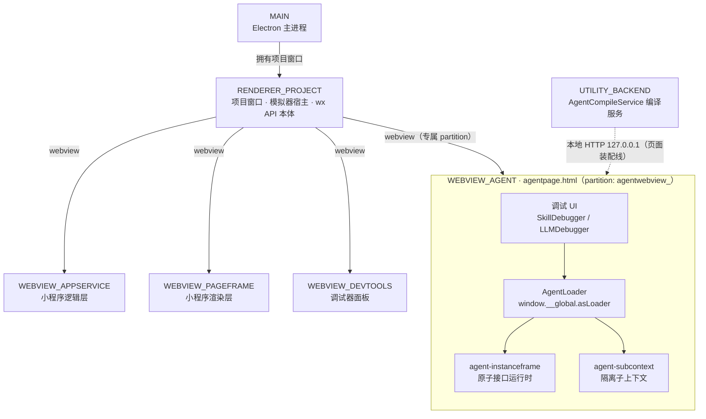
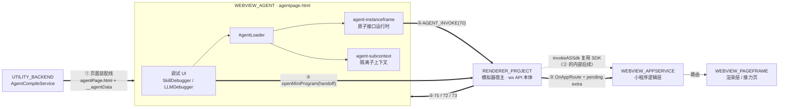
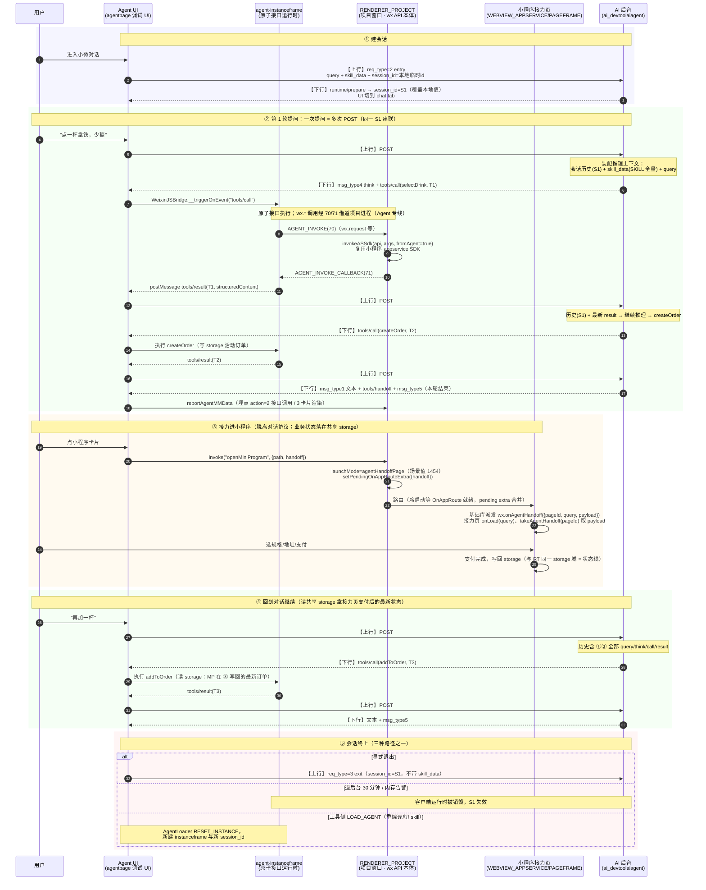
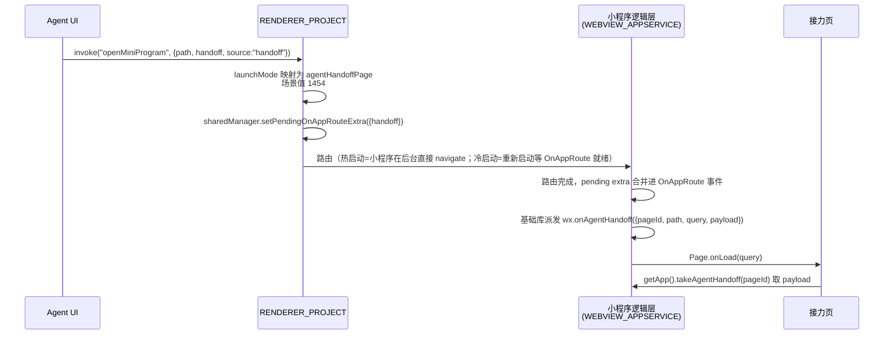

# 微信开发者工具 Agent（小程序 AI 编译）架构文档

> **性质**：纯实证文档（L1）。所有结论均来自对微信开发者工具 Nightly 版本 `app.asar` 解包源码（Webpack 打包后 JS）的直接阅读，以及官方文档本地镜像（`docs/wechat-ai-docs/`）的交叉印证。
>
> **定位**：本文档只描述「开发者工具里实际发生了什么」，不代表微信客户端真实环境的架构。工具是真实架构的**简化版 + 调试增强版**，两者的差异还原见《小微 AI 真实架构反推白皮书》。
>
> 源码证据**统一收录于附录 A**（按章节归档，路径相对于 `app.asar` 解包根目录），正文只保留源码符号名。

---

## 3 分钟速读（先看这里）

**一句话**：微信开发者工具里有一个「小程序 AI 编译」模式，本文讲的就是——当你按下这个开关后，工具**内部**到底发生了什么。

**读完你将能回答 5 个问题**：

1. 切换编译模式后，工具启动了什么？（→ §1：新开一个 webview，本地 HTTP 服务吐出三个页面）
2. 你写的 SKILL（SKILL.md + mcp.json）是怎么被工具读到的？（→ §2：编译服务装配成 `window.__agentData` 注入页面）
3. 工具里一共有**几个模块**、几个互隔离的执行上下文、消息怎么流转？（→ §3：7 个模块 + Agent 页内 4 个子模块 + 5 个执行上下文，三条消息线）
4. 对话时上下行报文长什么样、完整一轮对话怎么走？（→ §4：上行/下行报文全字段 + 一张完整对话时序图）
5. 点卡片跳进小程序页面，数据是怎么跟过去的？（→ §6：handoff 接力链路）

**前置知识**：会用微信开发者工具、知道小程序有「逻辑层/渲染层」之分即可。涉及 Agent 的专有概念（SKILL、原子接口、原子组件、handoff）全部在下方「术语对照」中先用一句话解释再使用。

**阅读约定**：

- 「**人话**」段落是每章的通俗概括，赶时间只读它们也能串起全貌；代码符号是给想深挖的人留的线索（完整文件路径见附录 A）。
- 文中 **L1** 是置信度标注，意为"源码直接实证"（另有 L2=官方文档明示、L3=业界类比推断，主要用在白皮书中）。
- 工具模块与真实客户端角色的对照见 **§3.5**，执行上下文清单与隔离性见 **§3.3**，证据为官方文档镜像（L2）。
- 「服务端」一词在本文有两个可能的所指，本文一律写全称：**工具本地页面服务**（AgentCompileService，跑在你电脑上）与 **AI 后台**（微信远程服务器），请注意区分。

---

## 0. 术语对照（核心概念）

| 术语 | 一句话含义 |
|---|---|
| **小微** | 微信里的 AI 助手；小程序通过「AI 开发模式」把自己的能力暴露给它调用。 |
| **SKILL（技能包）** | 开发者封装的一个业务能力包 = 一份说明书（SKILL.md）+ 一张能力清单（mcp.json）+ 接口实现代码。 |
| **mcp.json** | SKILL 的能力清单：声明有哪些原子接口、各自入参/出参的 JSON Schema、关联的卡片与页面。 |
| **原子接口** | 最小执行单元：一个 JS 函数，输入结构化参数、返回结构化结果，由 AI 按需调用（如 `searchDrinks`）。 |
| **原子组件** | 原子接口结果的可视化卡片（GUI）；当前小微阶段对话内不渲染，但代码保留。 |
| **handoff（接力）** | 对话里放不下复杂流程（选规格/地址/支付），AI 回复一张小程序卡片，用户点卡片跳进小程序页面继续办——这一"跳"就是接力。 |
| **NDJSON** | "换行分隔的 JSON"：一个文本里每行是一个独立 JSON 对象，逐行解析即得一组事件（详见 §4.2）。 |

源码符号对照（文档术语 ↔ 源码命名）见**附录 A.0**；工具模块 ↔ 真实客户端角色对照见**§3.5**；执行上下文清单见**§3.3**。

---

## 1. 启动链路：从「小程序 AI 编译」到 Agent Webview

> **人话**：你在工具里把编译模式切到「小程序 AI 编译」后，工具做了两件事——新开一个专门给 AI 用的 webview 窗口，并在你电脑上起一个本地 HTTP 服务，给这个窗口吐出三个页面：一个宿主页面（放调试 UI）、一个执行环境页面（跑你的原子接口代码）、一个隔离子上下文页面（备用）。

### 1.1 触发与切换

1. 编译模式下拉组件的 `onAgentToggleChange` 触发 `projectActions.setAgentCompile()`，dispatch `PROJECT_SET_AGENT_COMPILE` 并 `updateProject({agentCompile})`。工具栏文案常量 `TOOLBAR_AGENT_COMPILATION: '小程序 AI 编译'`。（证据见附录 A.1）
2. 前置条件（官方文档）：小程序已申请「开发模式」，调试基础库切到 3.16.1+，Nightly 工具。

### 1.2 Agent Webview 创建与页面服务

1. 模拟器视图组件创建 webview：`createWebview({ type: "agentwebview", partition: "agentwebview_" + runtimeId, name: EConstMessagerName.AGENT })`，然后 `webview.src = await serveAgent()`。
2. `serveAgent()` 由 SimulatorService 提供，返回本地 HTTP 地址：`http://127.0.0.1:<port>/agent/<sid>/_sessionId/<sid>/agentPage.html`。

   > **为什么需要本地 HTTP 服务？** Electron 的 webview 加载页面需要一个 URL。工具在你电脑上起一个 `127.0.0.1` 的 HTTP 服务，一是能把 SKILL 内容、配置等**动态注入**页面模板（见 §2）；二是让 agent 页面与小程序模拟器页面走同一套本地服务机制，方便统一管理。
3. 本地 HTTP 路由表 `"/agent/" → handleAgentRequest` 按路径分发：
   - `agentPage.html` → `getAgentEntrance`
   - `instanceframe*` → `getAgentInstanceFrame`
   - `*Context` → `getAgentSubContextFrame`
   三者均由 `AgentCompileService` 导出。

### 1.3 三个页面的分工

| 页面 | 角色 | 关键机制 |
|---|---|---|
| `html/agentpage.html` | Agent 宿主页：调试 UI（#agent-ui-root）+ AgentLoader | 占位符 `<!-- agentMBConfig -->`、`<!-- agentdata -->` 由工具本地页面服务（AgentCompileService）替换 |
| `html/agent-instanceframe.html` | 原子接口执行环境（iframe） | 加载 `/__dev__/assubloader.js`，调用 `window.top.__global.asLoader.handleLoadStart(window)` |
| `html/agent-subcontext.html` | 隔离子上下文（原子组件/实时组件用） | `__subcontext_ready__` / `__subcontext_ready_to_evaluate__` 握手协议 |

**关键事实**：`agent-instanceframe.html` 与 `appservice-instanceframe.html`（小程序逻辑层）**几乎逐字节相同**，差异仅在占位符 `agentMBConfig` vs `hookwx`；二者共用同一个 `assubloader.js`（其中无任何 agent 分支代码）。

> 推论：在工具中，原子接口的执行环境与小程序逻辑层是**同构但隔离**的实例——同一套子上下文加载机制，不同的 wx API 注入集（全部执行上下文的清单与隔离性见 §3.3）。

### 1.4 宿主页引导

`agentpage.html` 加载后执行 `agentasdebug.js`（即 `js/extensions/agent/index.js`，文件映射见 `getDebuggerFileCode`），其检测 `location.pathname.endsWith("agentPage.html")` 后：

1. 创建 `AgentLoader` 并挂为 `window.__global.asLoader`；
2. 创建 instanceframe iframe（原子接口运行时的宿主）；
3. 调用 `mountAgentUI()` 挂载调试 UI（React）。

---

## 2. SKILL 加载：`__agentData` 的装配

> **人话**：你项目里的 SKILL 目录（SKILL.md + mcp.json），工具是怎么"看见"的？——渲染宿主页面时，工具的编译服务把这些文件逐个读出来，连同 app.json 里的声明一起打包成一个全局变量 `window.__agentData`，直接写死在页面 HTML 里。页面一加载，调试 UI 就知道"这个小程序有哪些技能、每个技能有哪些接口"。

### 2.1 数据来源

`AgentCompileService` 在渲染 `agentpage.html` 时替换 `<!-- agentdata -->` 占位符为：

```
window.__agentData = { skills, pageMetaList, appName, isDarkMode [, evalCommitVersion] }
```

装配过程（证据见附录 A.2）：

1. 通过 `IAppConfigService.getAppConfig()` 读取 app.json 的 `agent.skills`（每项含 `name/description/path`）与 `agent.pageMetadata`（文件路径）；
2. 对每个 skill 目录读取：
   - `<path>/mcp.json` → 合并进 skill 配置（apis/components 声明）；
   - `<path>/SKILL.md` → 作为 `content`（online 模式读 `SKILL.json`；online 模式指连接线上环境的运行方式，区别于本地开发模式）；
3. 读取 `page-meta.json` 内容作为 `pageMetaList`；
4. 同时替换 `<!-- agentMBConfig -->` 注入 MagicBrush 配置；
5. 含越权防护：拒绝读取项目目录之外的文件。

### 2.2 大小校验（要点）

IDE 编译路径无大小校验；CLI 上传/预览路径对 mcp.json 限**单 skill 24000 字符**（去除 `outputSchema` 与空白后），总和限 `24000 × skills 数`；官方文档所述 SKILL.md 16000 字节限制未在工具源码中找到实现（疑在提审服务端）。明细见附录 B.3。

### 2.3 UI 侧消费

`mountAgentUI` 读取 `window.__agentData.skills`，建立 `componentPath → apiName` 映射（来自 `apis[].\_meta.ui.componentPath`），并把 skill 选择状态持久化到 `localStorage`（`skill-debugger-selected-skills`、`skill-debugger-tab`）。

---

## 3. 模块组成与消息流转

> **人话**：开发者工具不是"一个窗口一个页面"，而是**一组各司其职的模块**组成的"小社会"。本节回答四个问题：一共有几个模块（§3.1）、谁包含谁/谁依赖谁（§3.2）、运行时被切成几个互隔离的执行上下文（§3.3）、消息在模块之间怎么流转（§3.4）。

### 3.1 模块清单：7 个模块 + 4 个子模块

工具内与 Agent 模式相关的模块共 **7 个**（按进程/webview 划分，通道名即源码 `EConstMessagerName`，证据见附录 A.3）：

| # | 模块（通道名） | 类型 | 职责 | 与 Agent 模式的关系 |
|---|---|---|---|---|
| 1 | `MAIN` | Electron 主进程 | 应用生命周期 | — |
| 2 | `RENDERER_PROJECT` | 项目窗口渲染进程 | 模拟器宿主、**wx API 实现本体** | Agent 消息的集散中心 |
| 3 | `WEBVIEW_AGENT` | webview（agentpage） | Agent 宿主页 | **本文主角**，内部再分 4 个子模块（见下） |
| 4 | `WEBVIEW_APPSERVICE` | webview | 小程序逻辑层 | handoff 终点、SDK 复用方 |
| 5 | `WEBVIEW_PAGEFRAME` | webview | 小程序渲染层 | 接力页展示 |
| 6 | `WEBVIEW_DEVTOOLS` | webview | 调试器面板 | 与 agentwebview 同 partition |
| 7 | `UTILITY_BACKEND` | utility 进程 | 编译服务（AgentCompileService） | 吐出 agentPage.html + `__agentData` |

`WEBVIEW_AGENT` 内部再分 **4 个子模块**（都在 agentpage.html 这一个 webview 里）：

| 子模块 | 角色 |
|---|---|
| 调试 UI（SkillDebugger / LLMDebugger，React） | 对话流、单接口调试、卡片预览 |
| AgentLoader（`window.__global.asLoader`） | 管理 instanceframe 的创建/重置 |
| agent-instanceframe（iframe） | **原子接口执行环境**（跑你的 skill index.js） |
| agent-subcontext | 隔离子上下文（原子组件/实时组件用，备用） |

### 3.2 模块关系：挂载层级

**组织架构**一句话：主进程开项目窗口（RENDERER_PROJECT）；项目窗口按不同 `partition` 挂 4 个 webview；编译服务（utility 进程）通过本地 HTTP 给 Agent webview 供页。



关系要点：

- **包含关系**：MAIN ⊃ RENDERER_PROJECT ⊃ {WEBVIEW_AGENT, WEBVIEW_APPSERVICE, WEBVIEW_PAGEFRAME, WEBVIEW_DEVTOOLS}；WEBVIEW_AGENT ⊃ {调试 UI, AgentLoader, instanceframe, subcontext}。UTILITY_BACKEND 独立进程，仅靠 HTTP 与 Agent webview 相连。
- **各 webview 之间彼此看不见对方的 JS 变量**，只能靠消息协作（见 §3.4）；WEBVIEW_DEVTOOLS 与 WEBVIEW_AGENT 同 partition（共享存储域）。
- instanceframe 与小程序逻辑层**同构但隔离**（§1.3 关键事实）——这是 §4 中 wx API 要"借道"项目进程的根因。

### 3.3 执行上下文：有几个、互相隔离吗

> **人话**：一个 JS 执行上下文 = 一个独立的"JS 世界"（全局变量、原型链各是各的）。与 Agent 相关的"世界"共有 **5 个**；它们**看不见彼此的全局变量，只能走规定通道传数据**——唯一的例外是 storage（业务数据是打通的）。

与 Agent 相关的 JS 执行上下文共 **5 个**：

| # | 上下文 | 载体 | 运行什么 | 真实端对应（官方"三个独立 JS 上下文"） |
|---|---|---|---|---|
| 1 | Agent 宿主上下文 | `agentpage.html`（webview 主 frame） | 调试 UI、AgentLoader、MagicBrush | 官方未细分（对话 UI / 宿主） |
| 2 | 原子接口上下文 | `agent-instanceframe`（iframe） | skill index.js（原子接口实现） | **三上下文之一**（接口权限集） |
| 3 | 隔离子上下文 | `agent-subcontext` + MagicBrush（§5） | 原子组件 / 实时动态组件（工具内备用） | **另两个上下文**（组件/实时组件权限集；工具 1 个载体模拟真机 2 个） |
| 4 | 小程序逻辑层 | `WEBVIEW_APPSERVICE` | 小程序代码、接力页逻辑 | 小程序逻辑层（半屏页同环境、能力受限） |
| 5 | 小程序渲染层 | `WEBVIEW_PAGEFRAME` | 页面/接力页渲染 | 小程序渲染层 |

> RENDERER_PROJECT / UTILITY_BACKEND / MAIN / WEBVIEW_DEVTOOLS 也有各自的 JS 上下文，属**工具基础设施**，与 Agent 业务代码无直接交互，不计入。官方口径的"客户端运行时"只对应上表 #2/#3（三个隔离上下文），#1/#4/#5 是工具为调试与接力补齐的环境。

**隔离性分三层看**：

1. **JS 全局变量：完全隔离**（L2，官方原文"不同的 JavaScript 执行上下文不共享全局变量"；工具用 webview/iframe 边界同构模拟，L1）。上下文间传数据的**官方唯一通道**：原子接口返回值中的 `content`/`structuredContent`（作为 LLM 上下文上行）与 `_meta`（**对 LLM 不可见**，专供原子组件携带私有数据）——《FAQ》明示。
2. **wx API 权限：按上下文分级**（L2《API 支持列表》）：接口上下文可用 `wx.login`/`wx.request`/云开发等**数据生产类**；组件上下文相反，可用 `wx.requestPayment`/`wx.chooseAddress` 等**需用户手势的确认类**；工具内由"不同 wx API 注入集"模拟（§1.3 推论）。
3. **例外打通点：storage 不隔离**——原子接口与接力页/小程序**同一 storage 域**（L1，demo 实证 `orders_<openid>` 在两侧互见），即 §4.6 的**状态线**、handoff 闭环的前提；真机是否同域官方未明示。

**上下文间通信通道一览**（谁跟谁说话、走什么线）：

| 通道 | 连接的上下文 | 机制 |
|---|---|---|
| 调用注入 / 结果回传 | 宿主 ↔ 原子接口（同 webview 跨 frame） | `WeixinJSBridge.__triggerOnEvent` / `postMessage` |
| wx API 借道 | 原子接口 ↔ RENDERER_PROJECT | `AGENT_INVOKE(70)` / `AGENT_INVOKE_CALLBACK(71)` |
| 接口 → 组件数据 | 原子接口 → 原子组件（真机另两个上下文） | 返回值 `content`/`structuredContent`/`_meta`（官方唯一通道） |
| SDK 复用 / 路由 | RENDERER_PROJECT ↔ 小程序逻辑层 | `invokeASSdk` / `OnAppRoute`（§3.4 线②③） |

（各上下文与真实客户端角色的逐条对照见 §3.5。）

### 3.4 消息流转：三条线

模块间的消息按用途分**三条线**，互不混线：

#### 线 ①：页面装配线（启动时，一次）

```
UTILITY_BACKEND ──HTTP──→ WEBVIEW_AGENT
              （agentPage.html + __agentData + MBConfig，见 §1.2/§2）
```

#### 线 ②：Agent 专线（对话期间，双向）

Agent 消息共 4 条 CMD（源码 `EMessagerCMD` 70-73），**全部以 RENDERER_PROJECT 为集散中心**：

| CMD | 值 | 方向 | 触发时机 | 载荷/用途 | 终点消费方 |
|---|---|---|---|---|---|
| `AGENT_INVOKE` | 70 | instanceframe → RENDERER_PROJECT | 原子接口代码里调用 `wx.*` | wx API 名 + 参数 | `onInvokeAgentApi` → `invokeASSdk` |
| `AGENT_INVOKE_CALLBACK` | 71 | RENDERER_PROJECT → instanceframe | 70 的执行结果回传 | wx API 结果 | 接口代码的 Promise 恢复 |
| `AGENT_ON_EVENT` | 72 | RENDERER_PROJECT → WEBVIEW_AGENT | 项目进程主动下发事件 | `triggerOnEvent` 事件 | instanceframe 事件监听 |
| `AGENT_COMMAND` | 73 | RENDERER_PROJECT → WEBVIEW_AGENT | 生命周期/存储/主题命令 | `EAgentCMD`（见下） | AgentLoader |

`EAgentCMD`：`LOAD_AGENT`(AGC0)、`AGENT_RESET`(AGC1)、`AGENT_PRELOAD`(AGC2)、`AGENT_RESET_STORAGE`(AGC3)、`EXEC_STORAGE_SDK`(AGC4)、`STORAGE_ACTION`(AGC5)、`WRITE_LOG`(AGC6)、`ON_THEME_CHANGE`(AGC7)、`SYNC_STORAGE`(AGC8)。

收到 `LOAD_AGENT` 时，AgentLoader 执行 `setAgentReady(false)` → emit `RESET_INSTANCE` → `loadAgent()` 重建 instanceframe（会话级重置；重编译、切换调试 skill 等动作会触发，对应 §4.5 ⑤ 的会话终止路径之一）。

> **为什么 wx API 调用要经 RENDERER_PROJECT 中转？** 原子接口里写的 `wx.request`、`wx.login` 等 API，在模拟器里的"实现本体"住在项目进程（RENDERER_PROJECT）——那里本来就有小程序模拟器的一整套 wx API 实现。instanceframe 自己只是个空壳 JS 环境，调 `wx.xxx` 时实际是把调用打包成 `AGENT_INVOKE` 消息发给项目进程，由它执行后再把结果发回来；项目进程内部再经 `invokeASSdk(api, args, cb, fromAgent=true)` **复用小程序 appservice SDK**（即 WEBVIEW_APPSERVICE 那套实现）。

#### 线 ③：接力/路由线（handoff 时）

| 步 | 消息/动作 | 方向 |
|---|---|---|
| 1 | `invoke("openMiniProgram", {path, handoff})` | WEBVIEW_AGENT → RENDERER_PROJECT |
| 2 | launchMode 映射 `agentHandoffPage`（场景值 1454）+ `setPendingOnAppRouteExtra({handoff})` | RENDERER_PROJECT 内部 |
| 3 | 路由（冷启动等 `OnAppRoute` 就绪，合并 pending extra） | RENDERER_PROJECT → WEBVIEW_APPSERVICE |
| 4 | 基础库派发 `wx.onAgentHandoff` + `Page.onLoad(query)` | WEBVIEW_APPSERVICE → 接力页（渲染于 WEBVIEW_PAGEFRAME） |

#### 三线总览图



（MAIN 与 WEBVIEW_DEVTOOLS 不在三条线上：前者只管窗口生命周期，后者与 Agent 仅共享 partition。）

### 3.5 工具模块 ↔ 真实客户端角色对照

> 证据口径：**微信官方文档本地镜像**（`docs/wechat-ai-docs/`，L2）；官方未描述之处如实标注。官方把 Agent 侧只划为三方——**客户端运行时 / 小程序 AI 后台 / 第三方服务**，工具把这个"客户端运行时"拆成了 §3.1 的多个模块来模拟，本表就是"官方一句话 ↔ 工具实现"的翻译尺。

| 工具内模块/机制 | 真实客户端对应角色（官方口径） | 官方依据 |
|---|---|---|
| WEBVIEW_AGENT（agentpage 宿主页） | **客户端运行时**：微信客户端提供的独立代码运行环境，执行原子接口、渲染原子组件 | 《运行机制》三方职责 |
| agent-instanceframe | 原子接口执行上下文（官方：JSC/V8 创建的**三个独立 JS 上下文**之一，权限集=接口类 API） | 《运行机制》脚本执行环境 + 《API 支持列表》 |
| agent-subcontext | 原子组件 / 实时动态组件上下文（另两个上下文，工具用 subcontext 模拟） | 《运行机制》脚本执行环境 |
| MagicBrush（§5） | 自研卡片渲染引擎（**glass-easel** 组件框架） | 《运行机制》渲染环境 |
| WEBVIEW_APPSERVICE / WEBVIEW_PAGEFRAME | 小程序逻辑层/渲染层（半屏页与小程序同环境、部分能力受限） | 《运行机制》脚本执行环境·半屏页 |
| sendAgentChat ↔ ai_devtoolaiagent（§4） | 客户端运行时 ↔ 小程序 AI 后台的上行消息/回传结果/下发指令（官方：基于小程序 MCP，开发者无需理解协议细节） | 《运行机制》交互流程 |
| UTILITY_BACKEND（SKILL 装配 + 每请求全量上行） | 无完全对应：官方口径为后台"加载 SKILL"、客户端启动运行环境时下载分包 | 《运行机制》交互流程 |
| RENDERER_PROJECT | **官方未描述**（职能上近似微信客户端本体：宿主 + wx API 系统能力实现；此行为 L3 推断） | — |
| 调试 UI / WEBVIEW_DEVTOOLS / MAIN | 无对应物（工具独有调试增强） | — |

一句话：官方文档里的"客户端运行时"在工具里被**拍平进一个 agent webview**（instanceframe/subcontext 模拟三个执行上下文、MagicBrush 模拟渲染引擎）；RENDERER_PROJECT 承担的宿主与 API 实现职责在官方文档中没有对应描述——它只是工具的实现载体。

---

## 4. 协议链路：sendAgentChat 与 NDJSON

> **人话**：调试对话时，你输入的每句话都要送到微信的 AI 后台去"想"，"想"完再把指令送回来。这根"电话线"就是一个叫 `sendAgentChat` 的 API。本节回答：电话线插在哪（§4.1）、通话是一次说完还是慢慢聊（§4.2）、上行报文长什么样（§4.3）、下行报文长什么样（§4.4）、一轮完整对话在协议上怎么走（§4.5 一张完整时序图）、多轮上下文怎么记住（§4.6）。

### 4.1 后台接口

`SimulatorSDKApiAgentService.sendAgentChat`（证据见附录 A.4）：

- 请求：`requestService.requestWithAppId({ url: aiAgentChat, method: "post", needParse: -1, needToken: 1 })`
- 地址常量：
  - 正式：`https://servicewechat.com/aistream/wxa-dev-logic/ai_devtoolaiagent`
  - `--rdm` 模式：`https://wxardm.weixin.qq.com/`
  - 埋点接口：`agentNodeReport`（供 `reportAgentMMData`）

### 4.2 传输模型：一次性 POST + NDJSON 内容

「非流式」与「NDJSON」描述的是**两个层次**，拆开看：

- **传输层：一次性请求-响应（非流式）**。`sendAgentChat` 是普通 HTTP POST，不是 SSE/chunked 流。`needParse: -1` 表示工具 native 侧不解析响应，body 字符串原样透传给 UI 的 invoke 回调。因此调试 UI 里看不到逐字生成的"打字机效果"——与官方 FAQ「AI 回复的内容支持流式输出吗？**不支持**」互相印证。
- **内容层：body 内部是 NDJSON（换行分隔的多个 JSON 对象）**。body 虽一次性返回，其内容是"多行事件"，每行是本轮对话的一个独立事件/指令（形态见 §4.4）。agent UI 拿到完整 body 后自行 `split("\n")` → 逐行 `JSON.parse` → 按 `method` / `msg_type` 分发。
- **多轮 POST 循环：一次提问 = 多次 sendAgentChat**。非流式意味着"边想边做"要靠客户端反复回传结果来驱动：

```
第 1 次 POST: query="点一杯拿铁，少糖"   → NDJSON（内含 tools/call: selectDrink）
   …agent UI 驱动 instanceframe 执行原子接口…
第 2 次 POST: method="tools/result"     → NDJSON（内含 tools/call: createOrder）
   …再执行…
第 3 次 POST: method="tools/result"     → NDJSON（文本回复 + tools/handoff 卡片 + msg_type:5 结束）
```

后台每收到一次 `tools/result`，就基于最新结果继续推理，决定"再调一个接口"还是"直接回复"。**模型的多步编排 = 客户端多轮回传驱动**，而非一次请求内流式下发。

### 4.3 上行协议报文（agent UI → 后台，完整字段）

上行共两种形态：**对话请求**（首次进入/普通提问/退出共用一套结构，靠 `req_type` 区分）与 **tools/result 回传**（多轮驱动的关键）。

**形态 A：对话请求**（`req_type` = 1 chat / 2 entry / 3 exit）

| 字段 | 类型 | 含义 |
|---|---|---|
| `subagent_id` | string | 小程序 appId |
| `query` | string | 用户输入 |
| `req_type` | string | 1=对话 2=进入会话 3=退出会话 |
| `skill_data` | string(JSON) | **全量**技能包数据，结构见下 |
| `session_id` | string | 会话 id。首次本地生成临时 id（`session_<ts>_<n>`），收到下行正式 id 后覆盖 |
| `images` / `files` | array | 多模态附件 |
| `ext` | string(JSON) | 场景标记：`{"scene": 1}`=默认对话；`{"scene": 3}`=评测模式（evalCommitVersion）。单独调试某个接口时不用 scene，改用 `method="api/call"` 直调 |

```jsonc
{
  "subagent_id": "<appId>",
  "query": "用户输入",
  "req_type": "1",
  "skill_data": "<JSON string>",
  "session_id": "session_xxx",
  "images": [], "files": [],
  "ext": "{\"scene\": 1}"
}
```

**形态 B：tools/result 回传**（一次工具执行完毕后立即上行）

| 字段 | 类型 | 含义 |
|---|---|---|
| `subagent_id` | string | 同上 |
| `method` | string | `"tools/result"`（区别于形态 A 的 `query` 字段） |
| `session_id` | string | 同上，串联同一会话 |
| `skill_data` | string(JSON) | **每次仍全量携带**（同形态 A） |
| `content` | object | 原子接口返回值（非结构化） |
| `structuredContent` | object | 原子接口返回值（结构化，对应 mcp.json 出参） |
| `_meta` | object | 元信息（如 UI 元数据） |
| `isError` | bool | 接口执行失败标记 |

```jsonc
{
  "subagent_id": "<appId>",
  "method": "tools/result",
  "session_id": "session_xxx",
  "skill_data": "<JSON string>",
  "content": { /* 原子接口返回 */ },
  "structuredContent": { /* 结构化返回 */ },
  "_meta": { /* 元信息 */ },
  "isError": false
}
```

**`skill_data` 内容**（`buildSkillData()` 装配，两种形态共用）：

```jsonc
{
  "appInfo": { "appid": "<appId>" },
  "pageMetaList": "<page-meta.json 内容>",
  "skills": [{
    "subpackage": "skills",
    "skillPath": "skills/drink-skill",
    "skillDescription": "...",
    "skillName": "drink",
    "capabilityMarkdown": "<SKILL.md 全文>",
    "methods": { "apis": [/* mcp.json apis 数组 */] }
  }]
}
```

> **重要事实**：SKILL.md 与 mcp.json 的内容是**随每次请求上行**给后台的（包括每次 tools/result 回传），不依赖任何预部署。

### 4.4 下行协议报文（后台 → agent UI，NDJSON 逐行）

| 形态 | 字段 | 含义 |
|---|---|---|
| `method: "runtime/prepare"` | params | 会话准备（新 session_id，UI 切到 chat tab） |
| `method: "tools/call"` | params: name/arguments/toolCallId/subpackage/skillPath/toolMeta | 调用原子接口 |
| `method: "tools/card"` | params: containerId/containerSize/cardContext | 渲染原子组件卡片 |
| `method: "tools/handoff"` | params: handoffId/cardContext | 接力数据 |
| `method: "weapp/card"` | params（标题/图标等） | 小程序账号卡片（服务直达） |
| `msg_type: 1` | msg | 文本回复 |
| `msg_type: 4` | msg/think_id/if_finish_think | 思考过程（think） |
| `msg_type: 5` | — | 本轮结束 |

```jsonc
// NDJSON 示例（body 中的多行，每行一个事件）
{"session_id":"session_xxx","method":"runtime/prepare","params":"..."}
{"msg_type":4,"msg":"用户想点拿铁，需要先查饮品详情…","think_id":"t1","if_finish_think":true}
{"method":"tools/call","params":"{\"name\":\"selectDrink\",\"arguments\":{\"drinkId\":289},\"toolCallId\":\"tool_call_1693_1\",\"subpackage\":\"skills\",\"skillPath\":\"skills/drink-skill\"}"}
{"msg_type":5}
```

### 4.5 完整对话时序图（建会话 → 多轮工具调用 → 接力 → 继续 → 终止）

一张图覆盖全生命周期。参与者即 §3.1 的六个关键角色，其中 MP 合并代表 WEBVIEW_APPSERVICE + WEBVIEW_PAGEFRAME（被拉起的小程序/接力页）；消息标注「上行」（agent UI → 后台，即 §4.3 报文）与「下行」（后台 → agent UI，即 §4.4 报文）；颜色分组：蓝=建会话、绿=对话编排、橙=接力、红=终止。



执行闭环要点（图②的展开说明）：

- UI 通过 `window.__global.asLoader.getInstanceWindowSync()` 取得 instanceframe window，调用其 `WeixinJSBridge.__triggerOnEvent` 注入调用；结果经 `postMessage` 回 UI。
- instanceframe 内的 wx API 调用经 `AGENT_INVOKE(70)` 到 RENDERER_PROJECT，由 `onInvokeAgentApi` → `invokeASSdk(api, args, cb, fromAgent=true)` **复用小程序 appservice SDK** 执行。
- **工具源码中不存在 `wx.modelContext` / `wx.onAgentHandoff` 的实现**（全仓 grep 无 `createSkill`/`modelContext`/`onAgentHandoff`）。这些 API 由微信基础库（WAService，经 instanceframe 的 `beforebaselibready`/`vendorlist` 注入，不随 app.asar 分发）提供。

### 4.6 上下文维持：三条线

多轮对话的"记忆"由三条线合力维持，缺一不可（为与置信度标注 L1/L2/L3 区分，三条线用中文名）：

| 线 | 载体 | 内容 | 生命周期 |
|---|---|---|---|
| **会话线** | 后台，按 `session_id` 索引 | 历轮 query、think、tools/call、tools/result、回复文本 | 随会话销毁（30min/exit/RESET） |
| **能力线** | **无状态，每次请求全量上行** | `skill_data`（SKILL.md + mcp.json）+ `pageMetaList` | 每请求重建，服务端不持久化 SKILL |
| **状态线** | 客户端 storage（原子接口、接力页、小程序**同一 storage 域**） | 订单、地址、登录态等业务数据 | 跨轮、跨接力、跨会话持久（直到用户清数据） |

三个关键设计推论：

1. **服务端只记"对话"，不记"能力"**：每轮 POST 都全量携带 `skill_data`，改 SKILL.md/mcp.json 立刻生效、无需发版；mcp.json 24000 字符限额本质是单轮推理上下文体积控制。
2. **"记忆"分两层**：对话语义记忆在服务端（session_id），业务事实记忆在客户端 storage。第 ④ 步 `addToOrder` 能读到接力页支付后的订单，靠的是**状态线**而非**会话线**——**接力页与原子接口共享 storage 是 handoff 模式能闭环的前提**。
3. **session_id 的双向同步**：客户端首发生成临时 id，后台在下行报文（如 `runtime/prepare`）中下发正式 id，UI 收到即覆盖本地值（`session_id && (u = e.session_id)`），此后所有 POST 统一携带。

---

## 5. 卡片渲染：MagicBrush 模拟层（概述）

> **人话**：MagicBrush 是工具里**假装渲染卡片**的模拟器——真机上这活儿由 glass-easel 引擎（微信自研卡片渲染引擎）来干，工具里用一个 JS 实现的替身来模拟，让调试 UI 能看到卡片长什么样。

架构上只需知道两点：

- **容器模型**：每张卡片分配一个容器（`registerContainer(dom)` → `containerId`），下行的 `tools/card` 携带 `containerId + containerSize + cardContext` 定位渲染目标。
- **frameSet 协议**：通过 `createFrameSetRoot` / `createFrameSet` / `updateFrameSet` 模拟卡片与运行时之间的尺寸协商，以 `triggerOnEvent("surface:frameSetRoot:available")` 通知运行时。

> 对照：官方文档明确客户端真实渲染引擎为 **glass-easel**。MagicBrush 是工具的模拟实现，二者 API 面（frameSet/container）一致、实现不同。实现细节（双通道、本地存储 API、图片代理）见附录 B.1；角色对照见 §3.5。

---

## 6. Handoff 模拟链路

> **人话**：对话里放不下"选规格、填地址、支付"这种复杂流程，所以 AI 回复里带一张小程序卡片；用户点卡片，微信就拉起小程序的对应页面，并把 AI 侧准备好的数据（query + payload）一起"交接"过去。这一"交接"就是 handoff。工具里的模拟分两段：前半段是工具把"点卡片"翻译成"带特殊场景值打开小程序"（§3.4 线③）；后半段由基础库把交接数据派发给小程序代码（`wx.onAgentHandoff`）。



要点：

- launchMode 映射与场景值 1454（真机场景值 1443）的证据见附录 A.5；pending extra 合并逻辑同。
- `wx.onAgentHandoff` 的最终派发在基础库 WAService 内，工具源码中未实现（与 §4.5 一致）。
- 与 demo 实证吻合：`app.js` 的 `registerAgentHandoff` 按 `pageId` 缓存 `{path, query, payload}`，接力页 `onLoad(query)` 消费 query、`takeAgentHandoff(pageId)` 消费 payload。

---

## 7. 调试设施（概述，工具独有，真实环境无对应物）

工具为 Agent 模式提供一组调试增强：**SkillDebugger**（skill 切换、单接口手填参数调试、对话流、卡片预览）、**LLMDebugger**（评测模式，直接面向 LLM 请求/重放）、**单步入参出参观测**（toolCallId → Promise 挂起，UI 直接持有 resolver）、**埋点**（`reportAgentMMData`：action 2=接口调用、3=卡片渲染）、官方 **Trace 观测平台**（LLM 节点/接口调用节点/finalReply 节点 + 重放）。明细表见附录 B.2。

---

## 8. 一句话总结

开发者工具的 Agent 架构 = **「一个 webview 三件套」**（agentpage 宿主 + instanceframe 运行时 + subcontext 隔离上下文）+ **「一条 NDJSON 调试通道」**（sendAgentChat ↔ ai_devtoolaiagent）+ **「一套复用小程序的模拟层」**（asLoader 子上下文机制、invokeASSdk 复用、MagicBrush 渲染模拟、OnAppRoute 接力模拟）+ **「一组调试增强」**（SkillDebugger/LLMDebugger/Trace）。

真实微信客户端架构的反推，见《小微 AI 真实架构反推白皮书》。

---

## 附录 A：源码证据索引

> 以下路径均相对于 `app.asar` 解包根目录。

### A.0 源码符号对照

| 文档术语 | 源码中的名字 |
|---|---|
| 小程序 AI 编译模式 | `agentCompile` / `PROJECT_SET_AGENT_COMPILE` |
| Agent 宿主页 | `agentpage.html`（标题「Agent 运行时」） |
| 原子接口执行环境 | `agent-instanceframe.html`（Agent instanceframe） |
| 隔离子上下文 | `agent-subcontext.html` |
| 原子接口调用 | `tools/call`（NDJSON method） |
| 原子组件渲染指令 | `tools/card` |
| 接力 | `handoff` / launchMode `agentHandoffPage` |
| 调试后台接口 | `aiAgentChat`（`servicewechat.com/aistream/wxa-dev-logic/ai_devtoolaiagent`） |

### A.1 §1 启动链路

| 结论 | 证据 |
|---|---|
| 模式切换 `onAgentToggleChange` → `setAgentCompile` → `PROJECT_SET_AGENT_COMPILE` | `js/ce87c9cd2e517ff60c7ac02a107e9122.js`、`js/dccf81697d09871142273f7c1e53d534.js` |
| 工具栏文案 `TOOLBAR_AGENT_COMPILATION` | `js/98f15e8132a9f48937f4c8189466c73c.js` |
| `createWebview({type: "agentwebview", ...})` | `js/6276bd02d0499e417bc9e29e1d184e5b.js` |
| `serveAgent()` 返回本地 HTTP 地址 | `js/faab966f3c90c99cab787b9210bcfcd6.js` |
| 路由表 `"/agent/" → handleAgentRequest` | `js/dc871145408328b94ab65b8a759906ab.js` → `js/04a09e70340a7aeeaafe8349cfed796c.js` |
| 三页面导出（getAgentEntrance 等） | `js/fc39f313add60125c7ae5ef5ee698cfd.js` |
| instanceframe 与 appservice-instanceframe 共用 `assubloader.js`（无 agent 分支） | `js/extensions/appservice/subLoader/index.js` |
| `agentasdebug.js` 文件映射（`getDebuggerFileCode`） | `js/71a8af2979d539f909ce4fe0a6308076.js` |

### A.2 §2 SKILL 加载

| 结论 | 证据 |
|---|---|
| `__agentData` 装配（app.json 读取、mcp.json/SKILL.md 合并、占位符替换、越权防护） | `js/fc39f313add60125c7ae5ef5ee698cfd.js` |
| CLI 大小校验（24000 字符） | `js/common/cli/index.js` |

### A.3 §3 模块与消息总线

| 结论 | 证据 |
|---|---|
| 通道枚举 `EConstMessagerName`（MAIN/RENDERER_PROJECT/WEBVIEW_AGENT/…） | 模块 2755 |
| Agent 消息 `EMessagerCMD` 70-73 与 `EAgentCMD` | 同上及 §4 相关模块 |

### A.4 §4 协议链路

| 结论 | 证据 |
|---|---|
| `SimulatorSDKApiAgentService.sendAgentChat` | `js/7573739f299485b0eddbe2c8bf3da462.js`（注册于 `js/8e99c90b39822a36a85743235490e78d.js`） |
| 地址常量（正式 / `--rdm` / 埋点 `agentNodeReport`） | `js/711b38c25d26bfab5cdc3cfafe0a624b.js` |
| NDJSON 逐行解析与分发 | `js/extensions/agent/index.js`、`agentui.js` 的 `A()`/`L()` 函数 |
| `invokeASSdk(api, args, cb, fromAgent=true)` 复用 | `js/1d0037b06dcc001162ab8584fe69029f.js` |
| 上行报文字段（query/skill_data/req_type/ext 等）与 `buildSkillData()` | `js/extensions/agent/index.js`、`agentui.js` |
| `wx.modelContext` / `wx.onAgentHandoff` 全仓 grep 无实现 | 全仓检索（`createSkill`/`modelContext`/`onAgentHandoff`） |

### A.5 §6 Handoff

| 结论 | 证据 |
|---|---|
| launchMode 映射 `agentHandoffPage`、场景值 1454 | `js/3a491393b15d00efdc6f240f910a52ba.js` |
| pending extra 合并进 OnAppRoute | `js/0bef819d396f49a48c3e44596e3b3e51.js` |

---

## 附录 B：被压缩的实现细节

### B.1 MagicBrush 实现明细（§5）

工具中用 `MagicBrush` 类模拟原子组件渲染（`js/extensions/agent/index.js` 模块 9322）：

- **容器管理**：`registerContainer(dom)` 分配 `containerId`，`containerElements` 维护映射；`tools/card` 携带 `containerId + containerSize + cardContext`。
- **frameSet 协议**：`createFrameSetRoot` / `createFrameSet` / `updateFrameSet` / `bindCanvasToContainer`，通过 `triggerOnEvent("surface:frameSetRoot:available" ...)` 通知运行时。
- **双通道**：`bizToRenderChannel` / `renderToMainChannel`（Channel 类，发布/订阅），渲染侧与业务侧各有一套 `JSBridge` 注入（`injectMainGlobals` / `initRenderEnv`）。
- **本地数据**：`getLocalDataSync`/`setLocalDataSync` 等同步存储 API 由工具直接实现（模块 6432）。
- **图片代理**：重写 `window.Image` 的 src setter，把卡片里引用过的本地缓存路径映射回原网络 URL，避免调试 UI 里图片裂开。

### B.2 调试设施明细（§7）

| 设施 | 实现 | 说明 |
|---|---|---|
| SkillDebugger | `js/extensions/agent/agentui.js` | 常规模式 UI：skill 切换、单接口调试（手填参数）、对话流、卡片预览 |
| LLMDebugger | 同文件导出 | `evalCommitVersion`（评测）模式 UI，直接面向 LLM 请求/重放 |
| 单步/入参出参观测 | `onCallTool` 的 toolCallId 映射 + Promise 挂起 | UI 直接持有每次调用的 resolver |
| 埋点 | `reportAgentMMData` | action：2=接口调用、3=卡片渲染，字段含 api_name/api_description/component_name/session_id/run_status |
| 观测平台（Trace） | 官方文档第 4 章 | LLM 节点 / 原子接口调用节点 / finalReply 节点 + LLM 重放（面板实现不在 app.asar 主包内） |
| 主题 | `__setAgentTheme` / `ON_THEME_CHANGE`(AGC7) | dark/light 同步 |

### B.3 SKILL 大小校验明细（§2.2）

- **IDE 编译路径**（在工具窗口里点"编译"）：未发现大小校验（仅有解析失败报错）。
- **CLI 路径**（命令行上传/预览，走 `js/common/cli/index.js`）：`mcp.json` 删除所有 `outputSchema` 及空白后，单 skill 限 **24000 字符**（超限抛 `mcp.json too large for skill ... exceeds per-skill limit 24000`），总和限 `24000 × skills 数`。
- 未在工具源码中找到官方文档所述 SKILL.md 16000 字节限制的实现（可能在提审服务端校验）。
