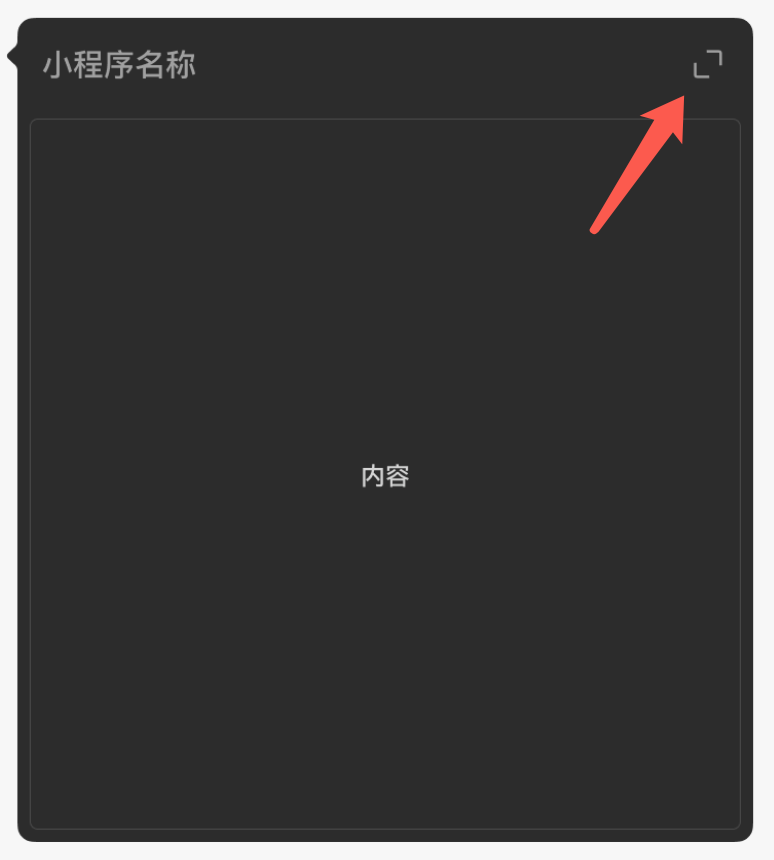
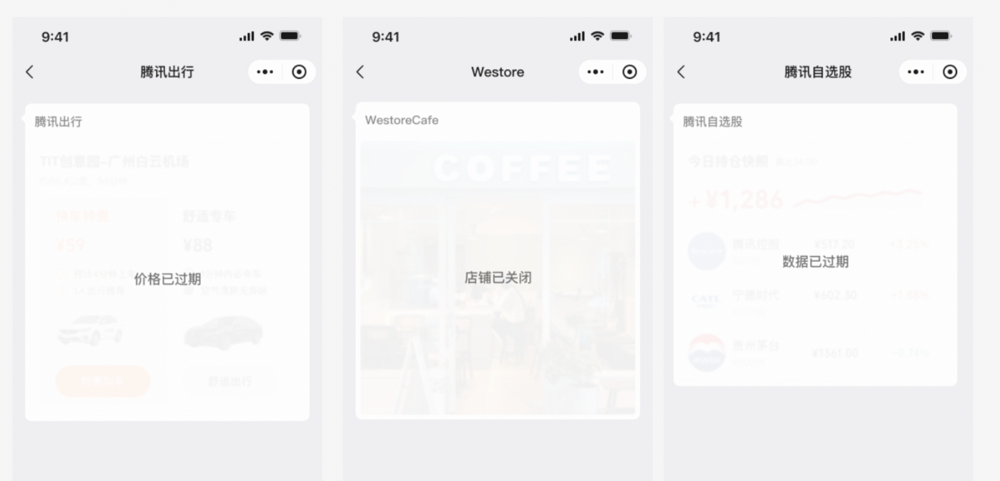
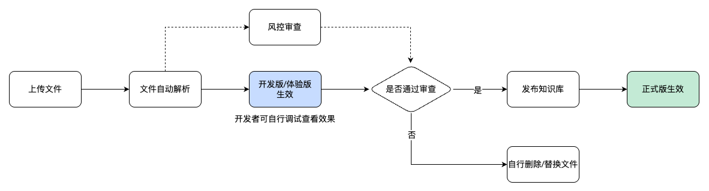
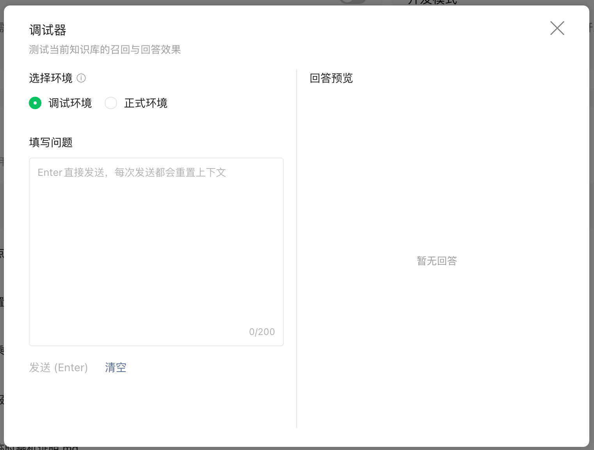

> 源页面：https://developers.weixin.qq.com/miniprogram/dev/ai/integration.html
> 抓取时间：2026-07-21

# 接入方式

小程序 AI 开发模式（以下简称此模式）提供了一套智能化的运行环境和开发框架，开发者可根据自身业务要求，参考本文档，将小程序的功能抽象为原子接口和原子组件，并封装成 `SKILL`，供小程序 AI 调用。

## 一、全局提示词

全局提示词可以用来整体说明此模式下提供的服务范围，提供相关的背景知识、行为逻辑和回答风格，引导小程序 AI 生成「猜你想问」的内容等等。

另一方面，一个小程序可能存在多个 `SKILLs`，多个 `SKILLs` 的关联关系及相关介绍也可以在全局提示词上说明，以帮助模型选择合适的 `SKILL` 和原子接口来为用户提供服务。

通常，全局提示词是一个名为 `AGENTS.md` 的文件，在小程序 AI 中，你可以这样指定它的路径：

> instruction 字段目前非必填，文件大小为最大 10000 字节。

## 二、SKILL 声明

一个小程序可声明多个 `SKILLs`，`SKILL` 必须封装在一个独立分包里，而一个独立分包可以放置多个 `SKILLs`，且需要全局开启按需注入 `lazyCodeLoading`。

app.json 中增加 `agent` 字段，声明 `SKILL` 列表（`agent.skills` 字段），每个 `SKILL` 的字段说明如下：

| 字段 | 必填 | 说明 |
| --- | --- | --- |
| name | 是 | 名称 |
| description | 是 | SKILL 简要说明 |
| path | 是 | SKILL 分包路径（绝对路径） |

> 目前一个小程序最多可以声明 30 个 SKILL。

## 三、SKILL 封装

`SKILL` 包含业务说明（`SKILL.md`）、模型可调用能力的声明（`mcp.json`）、原子接口（apis）与原子组件（components）的实现，其目录结构如下：

| 文件 | 说明 | 固定目录结构 |
| --- | --- | --- |
| SKILL.md | SKILL 的详细说明，只支持单文件，不支持引用其他 md 文件 | 是，最大长度 16000 字节 |
| index.js | 注册当前 SKILL 所涉及的所有原子接口 | 是 |
| mcp.json | 模型可调用能力的声明（当前 SKILL 所涉及的所有原子接口声明） | 是，最大长度 24000 字节 |
| components/ | 当前 SKILL 所涉及的原子组件代码实现的所在目录 | 否，仅作为建议 |
| apis/ | 当前 SKILL 所涉及的原子接口代码实现的所在目录 | 否，仅作为建议 |

> 目前计算 mcp.json 的长度时，会除去所有的 outputSchema 字段及空格、换行符后再计算。

### 3.1 模型可调用能力的声明

`mcp.json` 包含所有原子接口的 Schema 声明，其中 `componentPath` 表示该原子接口返回的结果可由原子组件展示卡片。`inputSchema` 和 `outputSchema` 需遵循 JSON Schema 规范。

| 属性 | 是否必填 | 说明 |
| --- | --- | --- |
| name | 是 | 标识符，跟 `index.js` 中导出的原子接口函数名一致 |
| description | 是 | 原子接口的功能描述 |
| inputSchema | 是 | 原子接口的入参，需为对象格式 |
| outputSchema | 建议填 | 原子接口返回的 `structuredContent` 对应的 schema |
| _meta | 否 | 可指定渲染的原子组件，`componentPath` 相对于 `SKILL` 目录，如 `{ "ui": { "componentPath": "path/to/comp" } }` |

下面是只有一个 getWeather 的原子接口的声明示例：

```json
{
  "apis": [
    {
      "name": "getWeather",
      "description": "获取指定城市的天气信息",
      "inputSchema": {
        "type": "object",
        "properties": {
          "city": { "type": "string", "description": "城市名称" }
        },
        "required": ["city"]
      },
      "outputSchema": {
        "type": "object",
        "properties": {
          "temperature": { "type": "number" },
          "weather": { "type": "string" }
        }
      },
      "_meta": {
        "ui": { "componentPath": "components/weather-card/index" }
      }
    }
  ]
}
```

#### 处理图片/文件内容

小程序 AI 的输入框支持了多模态上传，用户可以发送图片/文件给小程序 AI。如果需要处理用户上传的图片/文件，在原子接口的声明中，在 `inputSchema` 定义的字段中填写 `"format": "image" | "file"`，小程序 AI 会调用相应的原子接口，并将接收到的图片/文件传给对应字段。

### 3.2 原子接口实现

以原子接口 getWeather 为例，其返回值说明如下：

| 属性 | 类型 | 必填 |
| --- | --- | --- |
| isError | boolean | 否，默认为 false |
| content | ContentBlock[] | 是，返回给 LLM 的文本内容，不超过 200 KB |
| structuredContent | Record<string, unknown> | 否，返回给 LLM 的结构化数据，不超过 200 KB |
| handoff | HandoffResolver | 否，接力到小程序页面的数据，详情见下一节「小程序接力页」 |
| _meta | Record<string, unknown> | 否，对 LLM 不可见，可携带元数据，不超过 200 KB |
| apiCalls | { name: string; arguments: Record<string, unknown> }[] | 否，显式指定下一步调用的原子接口 |

其中 `isError`、`structuredContent`、`content` 三个字段的数据是会作为 LLM 的上下文供 LLM 理解，而 `_meta` 内容对 LLM 不可见，用于携带私有数据，传递给原子组件。

当 `isError: true` 时，将不进行 GUI 卡片渲染，`structuredContent` 将被忽略，`content` 常用于异常流程的引导。

当 `isError: false` 时，且该原子接口有绑定原子组件，小程序 AI 将倾向于渲染 GUI 卡片，`structuredContent` 数据会传给原子组件用来渲染（便于模型理解 GUI 卡片的内容），`content` 用于后续流程引导。比如，如需强制出 GUI 卡片时，可在 `content` 里追加引导：「接下来为用户展示 XXX UI 卡片」。

ContentBlock[] 目前只支持 TextContent，其定义如下：

```ts
type TextContent = {
  type: 'text'
  text: string
}
```

HandoffResolver 定义如下：

```ts
type HandoffResolver = {
  path?: string        // 允许动态指定页面路径
  query?: string       // 页面 query 字符串
  payload?: any        // 业务数据
}
```

在原子接口的内部实现中，可以通过 `wx.request` 从服务器请求数据，也可以通过微信云开发调用云函数或数据库获取数据。

下面是原子接口 getWeather 的代码实现示例：

```js
// apis/getWeather.js
export async function getWeather({ city }) {
  const res = await wx.request({
    url: 'https://api.example.com/weather',
    data: { city }
  })
  return {
    content: [{ type: 'text', text: `${city}今日天气：${res.data.weather}，温度 ${res.data.temperature}°C` }],
    structuredContent: res.data,
    _meta: { lastQuery: city }
  }
}
```

#### 显式指定下一步调用的原子接口

在某些较固定流程的场景中，需要在一次原子接口调用之后，明确要触发下一个原子接口的调用。此时，可显式指定要调用的原子接口，以减少模型推理的耗时。

```js
return {
  content: [...],
  apiCalls: [
    { name: 'getWeather', arguments: { city: '深圳' } }
  ]
}
```

### 3.3 注册原子接口

在 `path/to/pkg/weatherSkill/index.js` 进行注册，当小程序 AI 发起原子接口调用时，就会在注册列表中找到原子接口的函数入口并执行：

```js
import { getWeather } from './apis/getWeather'

module.exports = {
  getWeather
}
```

#### 中间件机制

为了方便在多个原子接口同时处理一些公共逻辑，我们提供了原子接口中间件的机制，可用于统一登录态、统一上报和错误监听等场景。

- `wx.modelContext.createSkill(skillPath: string)` // 创建 skill，传入的 skillPath 参数与 app.json 上的 `agent.skills[].path` 一致
  - `skill.use(Middleware)` // 注册中间件
  - `skill.registerAPI(name, handler)` // 注册原子接口，等同于 `wx.modelContext.registerAPI('name', handler)`

示例：

```js
const skill = wx.modelContext.createSkill('path/to/pkg/weatherSkill')

const authMiddleware = async (ctx, next) => {
  // 前置：统一登录态
  ctx.loginState = await getLoginState()
  try {
    await next()
    // 后置：统一上报
  } catch (err) {
    // 错误监听
    throw err
  }
}

skill.use(authMiddleware)
skill.registerAPI('getWeather', getWeather)
```

核心语义：

- 每次原子接口调用都会执行中间件
- `next()` 前原子接口调用的前置逻辑，`next()` 后是后置逻辑，try/catch 包裹可捕获错误
- 整个中间件链与原子接口执行时间共享超时上限（当前为 300s）
- 支持多个中间件：按注册顺序形成链，外层 -> 内层 -> handler -> 内层 -> 外层
- 中间件函数为 async 类型，运行时 await 整个链路

### 3.4 接力到小程序页面

> 此特性的版本支持范围：微信 iOS 8.0.75，基础库 3.16.2，开发者工具 nightly 2.02.2607032

原子接口返回的结构化数据有两种呈现方式，其中一个是小程序页面，也就是在对话流程中，原子接口被调用后所返回的数据会传入小程序页面，将对话流程接力到小程序页面内，以无缝衔接当前流程状态。

实现上，分以下三步：

#### 1、在 mcp.json 声明原子接口对应的 pagePath

```json
{
  "apis": [
    {
      "name": "getWeather",
      "pagePath": "pages/weather/index"
    }
  ]
}
```

> pagePath 暂不支持动态改变

#### 2、原子接口返回 handoff 对象

在原子接口返回 `handoff` 对象，与 `content` / `structuredContent` 字段同级。`handoff` 对象包含 `query` 与 `payload` 字段，其中 `query` 与前面的 `pagePath` 字段构造出打开小程序页面的链接，而 `payload` 字段通过 `wx.onAgentHandoff` 接口传递给小程序。

| 字段 | 必填 | 说明 |
| --- | --- | --- |
| path | 否 | 允许动态指定页面路径 |
| query | 否 | 页面 query 字符串，小程序页面通过 Page.onLoad 和 wx.onAgentHandoff 获取 |
| payload | 否 | 可传递原子接口返回的业务数据，用于小程序页面同步对应的流程状态，小程序页面通过 wx.onAgentHandoff 获取 |

下面是原子接口 getWeather 的代码实现示例：

```js
return {
  content: [...],
  structuredContent: {...},
  handoff: {
    query: 'city=shenzhen',
    payload: { city: 'shenzhen', temperature: 28 }
  }
}
```

#### 3、小程序监听 wx.onAgentHandoff 获取 handoff 数据

小程序通过 `wx.onAgentHandoff` 获取原子接口传过来的 `handoff` 数据，用于将页面同步至对应的流程状态，必要时，也需将业务流程对应的页面栈同步成合适的状态。

| API | 说明 |
| --- | --- |
| wx.onAgentHandoff(callback) | 点击小程序卡片进入时触发 |
| wx.offAgentHandoff(callback) | 取消监听 |

回调参数：

```ts
type AgentHandoff = {
  query: string
  payload: any
}
```

代码示例：

```js
Page({
  onLoad() {
    wx.onAgentHandoff((data) => {
      console.log('接力数据：', data.query, data.payload)
      // 同步当前页面状态
    })
  },
  onUnload() {
    wx.offAgentHandoff()
  }
})
```

总体上，可参考示例 demo。

### 3.5 原子组件实现

> 暂不支持调试

#### 3.5.1 原子组件定义

原子组件用于承接原子接口返回的结构化数据的展示。在编码上，其与小程序的自定义组件一致，不过需要注意的是，**原子组件不可声明为虚拟组件**。

通过 `wx.modelContext.getContext` / `getViewContext` 获取原子组件渲染时需要的尺寸、数据等信息。

#### 3.5.2 关联小程序页面（必须）

原子组件渲染出来的 GUI 卡片上方有个标题栏，其右上方提供进入小程序的入口，该入口需配置与原子组件关联的小程序页面，是必填项。通过此方式进入小程序的场景值为 **1442 或 1443**。



实现上，分为两步：

**1、在 mcp.json 声明原子组件所对应的小程序页面的完整 path（固定 path）：**

```json
{
  "components": [
    {
      "path": "components/weather-card/index",
      "pagePath": "pages/weather/index"
    }
  ]
}
```

**2、在原子组件渲染时，动态设置页面的 query 参数：**

```js
const ctx = wx.modelContext.getViewContext(this)
ctx.setRelatedPageQuery({ city: 'shenzhen' })
```

#### 3.5.3 原子组件的约束

**原子组件的运行环境与原子接口隔离，处于不同的上下文中**，其可调用的接口能力也与原子接口有所不同。

原子组件存在以下特性与限制：

- 原子组件的渲染区域有限，其宽度随屏幕宽度变化，其最小高度是宽高比 4:1，最大高度是宽高比 1:1，不超出最小最大高度时，随内容自动撑高
- 初始化时决定卡片高度，后续不可再改变高度
- 仅支持 tap 点击、Image load、image error 事件，不支持其他交互事件
- 默认不支持网络请求和云开发接口，需声明为「实时动态组件」
- 默认不支持定时器接口，如 setTimeout、setInterval，需声明为「实时动态组件」
- 不支持打开小程序接口
- 不支持动画
- 禁止上下滚动（即禁止使用 overflow-y）
- 支持点击后帮用户上行一条文本消息（`ModelContext.sendFollowUpMessage`），效果等同于用户语音发送一条文本消息
- 支持点击后打开半屏页面（见下节）

#### 3.5.4 实时动态组件

对于需要展示实时动态内容的合理的场景，可在 `mcp.json` 声明需要实时动态能力（支持 `wx.request`、定时器等接口）

```json
{
  "components": [
    {
      "path": "components/weather-card/index",
      "realtime": true,
      "usage": "需要每 30 秒刷新一次天气数据"
    }
  ]
}
```

注意：此能力需要单独审核（正常提审即可），请声明使用场景，非必要场景不建议使用。

#### 3.5.5 原子组件过期态

支持通过接口形式，将已经渲染出来的原子组件置为过期态，防止用户再次点击。



**1、组件过期声明**

在 `mcp.json` 的 `components` 字段下声明：

| 字段 | 类型 | 必填 | 说明 |
| --- | --- | --- | --- |
| path | string | 是 | 组件路径（相对于 skill 目录） |
| expirable | boolean | 否 | 声明该组件渲染的卡片是否可被过期，默认 false |
| expiredText | string | 否 | 过期后显示的文案，默认「服务已过期」 |

```json
{
  "components": [
    {
      "path": "components/weather-card/index",
      "expirable": true,
      "expiredText": "该天气查询已过期"
    }
  ]
}
```

**2、组件过期接口**

提供两种粒度的过期 API：

**方式一：`wx.modelContext.expireAllCards()`**

可在原子接口/组件里调用。所有声明了 `expirable: true` 的组件（包括自身），将被标记为过期并渲染蒙层。

```js
wx.modelContext.expireAllCards()
// 或按 componentPath 过滤
wx.modelContext.expireAllCards({ componentPath: 'components/weather-card/index' })
```

同时支持按 `componentPath` 过滤，使所有相同的 `componentPath` 的原子组件或最近一个特定的 `componentPath` 的原子组件过期。

**方式二：`wx.modelContext.getViewContext(this).expirePreviousCards()`**

只能在原子组件里调用，之前渲染过的原子组件，声明了 `expirable: true` 的将被标记为过期并渲染蒙层。

```js
const ctx = wx.modelContext.getViewContext(this)
ctx.expirePreviousCards()
// 或按 componentPath 过滤
ctx.expirePreviousCards({ componentPath: 'components/weather-card/index' })
```

**3、组件过期事件**

原子组件被置为过期时，会收到过期事件，此时原子组件内部可以做一些必要的清理。

```js
Component({
  methods: {
    onExpire() {
      // 清理定时器等
    }
  }
})
```

#### 3.5.6 半屏原子组件

对于列表场景，在卡片里面可能难以承载全部列表项，这时可以使用半屏原子组件，对卡片进行半屏化，呈现更多的内容。

**使用方式**

提供 `collapsible-view` 组件：

- 自定义内容：可以放置任意内容。
  - 在原子组件下：会根据卡片可用空间计算可展示的内容，超过的内容直接隐藏。
  - 在半屏原子组件下：全部展示。
- 自定义展开按钮：提供 `slot: button` 用于自定义展开按钮的形式，在半屏形态下会自动隐藏。

**最佳实践**

为避免由于组件可用空间不足导致自定义内容被全部隐藏，推荐把每一项作为 `collapsible-view` 的直接子节点，这样空间不足时，能正确展示和隐藏对应的节点。

**注意**

- 半屏原子组件只是原子组件的延伸，仍视为是原子组件，所以原有的限制仍然存在。

#### 3.5.7 同步交互状态给模型

用户在原子组件卡片上进行交互操作（如点击按钮、选择选项等）修改卡片状态时，可通过 `updateModelContext` 接口将状态变更同步给模型，以便模型感知用户的最新选择并做出后续响应。

##### 使用方式

```js
const ctx = wx.modelContext.getViewContext(this)
ctx.updateModelContext({
  content: [{ type: 'text', text: '用户选择了深圳' }]
})
```

##### 参数说明

| 参数 | 类型 | 必填 | 说明 |
| --- | --- | --- | --- |
| `content` | `Array<{ type: 'text', text: string }>` | 是 | 内容块数组，当前仅支持 `text` 类型 |

##### 注意事项

- **需在用户点击手势中调用**：必须在用户的 tap 点击事件回调中调用，不可在异步逻辑或定时器中调用
- **节流限制**：短时间内重复调用会被拒绝
- **内容校验**：`content` 必须为非空数组，且每个内容块的 `text` 不能为空

### 3.6 半屏页面

> 暂不支持调试

半屏页面是原子组件内容的延伸，是个非必要流程，只有当需要展示更多详情信息，或者需要用户补充信息时，才使用半屏页面能力，通过点击原子组件上的某个按钮打开半屏页面。

半屏页面的环境可以认为是与小程序的环境一致，可以用已有的小程序页面来加载，但**不允许任何跳转**，包括所有跳出半屏的接口、页面路由接口、广告相关接口组件。

当用户需要进行下一步时，应是点击半屏里的某个按钮，触发上行一段文本消息，此时会同时关闭半屏页面回到小程序 AI 界面，小程序 AI 继续处理新的用户请求。

> 注：半屏打开小程序页面的场景值为 **1433 或 1434**

> 注：通过 `wx.getDetailPageCloseButtonBoundingClientRect` 接口适配左上角关闭按钮

#### 3.6.1 半屏页面实现

在原子组件内，响应点击并打开半屏页面（原子接口内不可调用）：

```js
const ctx = wx.modelContext.getViewContext(this)
ctx.openDetailPage({
  path: 'pages/weather-detail/index',
  query: 'city=shenzhen'
})
```

在半屏页面中，代用户上行一条文本消息（同时会关闭半屏页面）：

```js
wx.modelContext.sendFollowUpMessage({
  content: [{ type: 'text', text: '帮我查一下深圳明天的天气' }]
})
```

**注意：需要以用户第一人称的角度来发送这条消息。**

若半屏页面是 web-view 加载的 h5 页面，则上行文本消息的方式是：

```js
// 在 h5 内通过 wx.miniProgram API 调用
wx.miniProgram.postMessage({
  data: {
    type: 'sendFollowUpMessage',
    content: [{ type: 'text', text: '...' }]
  }
})
```

#### 3.6.2 半屏页面的约束

半屏页面的执行环境与小程序页面一致，但可调用的接口能力有所不同。半屏页面存在以下限制：

- 所有跳出半屏去往公众号、视频号、其他小程序、表情、问一问、地图 App 的接口
- 所有页面路由接口
- 所有广告相关的接口组件

#### 3.6.3 半屏页面预加载

为了给用户提供更好的体验，我们提供了预加载半屏页面的能力，若当前原子组件存在调用拉起半屏页面的逻辑，开发者可以在原子组件创建后调用 `preloadDetailPage`：

```js
const ctx = wx.modelContext.getViewContext(this)
ctx.preloadDetailPage({
  path: 'pages/weather-detail/index',
  query: 'city=shenzhen'
})
```

#### 3.6.4 从半屏页面返回并更新卡片

在通过小程序 AI 完成用户需求的过程中，有时需要通过拉起半屏页面操作后，更新卡片内容，我们支持了通过重新调用对应的原子接口的方式，来重新渲染原子组件。在这种方式下，既能通过半屏页面操作更新卡片内容，也能通过用户语音交互来更新。

打开半屏页面的调用链为：原子接口 -> 原子组件 -> 半屏页面，在半屏页面里，调用 `ModelContext.reapplyApiCall` 重新执行调用链。

```js
wx.modelContext.reapplyApiCall()
```

## 四、知识库

小程序 AI 开发模式下，添加知识库后，模型可根据具体情况选择检索知识库内容作为回答依据。例如，可以服务于专业领域问答、企业智能助手等场景，通过提供专业知识、FAQ 等自定义内容为用户提供更准确的回答。

### 4.1 知识库的调用逻辑

当 C 端用户提问后，调用知识库的大致逻辑是：

1. 用户输入问题，模型分析问题意图。
2. 模型尝试根据语义来匹配 `SKILL`。
3. 如果用户问题属于知识查询，且与所有 `SKILL` 都不匹配，才会调用知识库查询。
4. 拿到结果后，模型组织语言回复用户。

**注意：**

- **模型会自主决策知识库的调用时机**，建议优化 `SKILL` 描述、文档质量，让模型更容易做出正确判断。
- 如果在特殊情况下更倾向调用知识库来解决用户需求，可以在全局提示词 `AGENTS.md` 或对应 `SKILL` 中进行引导。
- 如果所有 `SKILL` 都不匹配，会使用知识库来兜底。

### 4.2 实操流程



**1. 上传文件**

上传入口：微信公众平台 > 基础功能 > AI能力 > 知识库

文件要求：

- 文件格式：PDF、DOC、DOCX、PPT、PPTX、TXT、MD、XLSX
- 单文件大小上限：10MB
- 文件总数上限：10 个

**2. 自行测试召回效果**

文件解析完成后即可测试召回（不需要等审核通过），目前有两种测试渠道：

- **开发版/体验版**（完整效果）
  - 直接测试 C 端实现效果
  - 如果想要测 `SKILL` + 知识库的回答效果，只能在开发版/体验版测试
- **公众平台调试器**（简易效果）
  - 上传后快速验证文件是否被正确切片召回
  - 非 C 端最终回答效果，无上下文，无法调用 `SKILL`



**3. 发布至正式版**

文件审核通过，且确认召回效果符合预期后，点击「发布」。文件状态变为「已发布」则表示生效，正式版可召回该文件。

> 注：由于内测阶段开发模式相关代码不建议合入正式版，目前知识库效果仅在开发版和体验版开放体验。

## 五、小程序服务直达

当用户需要快速触达小程序内的相关服务页面时，小程序 AI 支持以「账号卡片」的形式回复用户，用户可直接点击进入小程序。

该能力需要开发者提供页面元数据，小程序 AI 将根据用户问答的上下文，在满足用户意图时，生成小程序账号卡片发送给用户。通过此方式进入小程序的场景值为 **1435 或 1436**。

**页面元数据定义**

app.json 里增加 `pageMetadata` 字段：

```json
{
  "pageMetadata": "page-meta.json"
}
```

`page-meta.json` 中定义了页面的功能和所需 query。query 为一个标准的 object 格式 JSON-Schema。

| 字段 | 必填 | 功能 |
| --- | --- | --- |
| path | 是 | 页面路径，可带固定的 query 信息 |
| name | 是 | 页面标题 |
| description | 是 | 页面的功能描述 |
| query | 否 | 页面 query |

目前 page-meta.json 的最大长度为 8000 字节。
