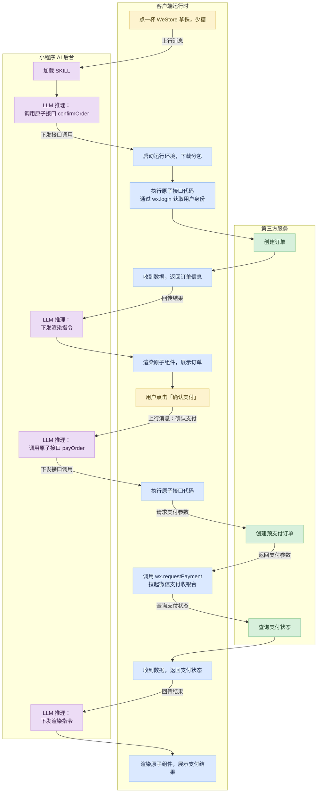

> 源页面：https://developers.weixin.qq.com/miniprogram/dev/ai/operating-mechanism.html
> 抓取时间：2026-07-21

# 运行机制

小程序 AI 开发模式的运行机制涉及客户端运行时、小程序 AI 后台、第三方服务之间的交互，各自的职责如下：

- **客户端运行时**：由微信客户端提供的独立代码运行环境，用来执行开发者提供的原子接口，渲染原子组件为用户展示 GUI 卡片
- **小程序 AI 后台**：小程序 AI 后台会根据开发者封装的 `SKILLs`，结合用户的请求，发起必要的原子接口调用或渲染原子组件的指令
- **第三方服务**：开发者在原子接口的实现中，调用自身的服务完成数据交互，并返回必要的数据给到小程序 AI，供小程序 AI 理解及完成用户的请求

微信客户端与小程序 AI 后台基于小程序 MCP 完成交互，开发者无需理解交互协议细节，只需要按框架设计提供完整的 `SKILL` 实现，小程序 AI 就能正确地推理及执行相应的原子接口。

## 运行环境

开发者提供的原子接口和原子组件是在微信客户端创建的一个独立环境中运行，该环境与小程序的运行环境不同。

### 脚本执行环境

脚本执行环境是由 JavaScriptCore / V8 引擎创建的新的独立环境，需要特别留意的是，原子接口、原子组件、实时动态原子组件分别在该 JavaScript 环境中三个不同的执行上下文中运行，拥有不同的接口权限集。

> 不同的 JavaScript 执行上下文不共享全局变量

此外，打开半屏页面的能力中，半屏页面的运行环境与小程序的运行环境完全一致，区别在于，半屏页面的环境下，部分组件/接口能力有所受限。

### 渲染环境

原子组件是使用微信小程序团队自研的卡片渲染引擎进行渲染，组件框架采用 glass-easel 框架。在编码上，与小程序的自定义组件一致，需要留意的是，WXSS 样式集与小程序的 WebView / Skyline 引擎有所差异，具体支持的特性见底部附录。

## 生命周期

当用户与小程序 AI 开始对话时，我们会起一个新的会话来承载，用户在该会话的聊天记录会一直对用户与小程序 AI 可见，直到客户端运行时结束，会话终止，下一次用户重新进入会是一个全新的会话。

客户端运行时有以下几种情况会结束：

- 小程序 AI 退至后台 30 分钟后（与小程序后台保活时长一致），微信客户端会主动结束客户端运行时
- 小程序 AI 退至后台后，由于系统内存告警，微信客户端可能会清理客户端运行时
- 用户重新启动小程序 AI

## 交互流程

以一个简化的场景为例，交互流程如下所示



## 附录

### WXSS 语法支持范围

#### 1. 选择器支持

出于性能考虑，仅支持少量 CSS 选择器：

- 类选择器 `.my-class {}`；
- ID 选择器 `#my-id {}`；
- 标签名选择器 `view {}`；
- 后代选择器（空格分隔）。

以上选择器可以按照 CSS 规范来组合，例如：

```css
.my-class view #my-id {}
```

也可以用逗号 `,` 来让多个选择器共享一组样式，例如：

```css
.my-class, #my-id {}
```

需要注意的是，类选择器编写的样式具有独特的优化，因而推荐尽可能使用类选择器来编写样式。

#### 2. 媒体查询

CSS Media Queries 媒体查询语法是受支持的，例如：

```css
@media (min-width: 300px) {}
```

支持的判断条件见下表。

| 判断条件 | 值类型 | 说明 |
| --- | --- | --- |
| orientation | string | landscape 表示宽大于高，portrait 宽不大于高 |
| width | number | 宽度精确值 |
| min-width | number | 宽度下限 |
| max-width | number | 宽度上限 |
| height | number | 高度精确值 |
| min-height | number | 高度下限 |
| max-height | number | 高度上限 |
| prefers-color-scheme | string | 当前环境主题，通常是 light 或 dark |

此外，`not` 和 `and` 关键字也受支持；基本媒体类型仅有 `all` `screen` 两种，因而通常并不需要写明。

#### 3. 尺度单位

在表达长度时，支持以下绝对长度单位：

- 像素（逻辑像素）`px`；
- 相对于显示区域宽度的百分点 `vw`；
- 相对于屏幕宽度的 750 分点 `rpx`（非 CSS 标准）。

相对于字体的长度单位 `em` 和 `rem` 也可以使用，但有以下注意事项。

- `rem` 是相对于根节点的字体尺寸，但目前还不能指定根节点的字体尺寸。
- `em` 是当前节点的字体尺寸。但如果一个 `em` 的值是从父节点继承的，在 lib v5.x 上它是相对于当前节点的字体尺寸，而 lib v6.x 上它是相对于父节点的字体尺寸。

#### 4. env

在表达长度时，可以使用几个环境值，例如：

```css
width: env(safe-area-inset-left);
```

可用的环境值见下表。

| 环境值 | 类型 | 说明 |
| --- | --- | --- |
| safe-area-inset-left | 长度 | 安全区左侧距离 |
| safe-area-inset-top | 长度 | 安全区顶部距离 |
| safe-area-inset-right | 长度 | 安全区右侧距离 |
| safe-area-inset-bottom | 长度 | 安全区底部距离 |

#### 5. calc

在表达长度时，可以使用 `calc()` 函数，例如：

```css
width: calc(100% - 20px);
```

#### 6. 字体定义

支持通过 CSS 加载自定义字体。但目前高级语法受到一定限制，仅能使用基础语法，例如：

```css
@font-face {
  font-family: "MyFont";
  src: local("MyFont"), url("https://example.com/myfont.woff2") format("woff2");
}
```

### WXSS 属性支持范围

#### 1. 基础定位

| 属性 | 默认值 | 有效值 | 备注 |
| --- | --- | --- | --- |
| display | inline | none inline inline-block block flex |  |
| position | static | relative absolute | static 视为 relative |
| box-sizing | content-box | content-box padding-box border-box |  |

#### 2. 可点击性

| 属性 | 默认值 | 有效值 | 备注 |
| --- | --- | --- | --- |
| pointer-events | auto | auto none |  |

#### 3. 颜色与可见性

| 属性 | 默认值 | 有效值 | 备注 |
| --- | --- | --- | --- |
| color | transparent | 任何 CSS 标准色值 |  |
| opacity | 1 | 0 ~ 1 之间数值 |  |
| visibility | visible | visible hidden |  |

#### 4. flex 布局

| 属性 | 默认值 | 有效值 |
| --- | --- | --- |
| flex-direction | row | row column |
| flex-wrap | no-wrap | no-wrap wrap wrap-reverse |
| align-items | stretch | stretch normal center flex-start flex-end baseline |
| align-self | stretch | auto stretch normal center flex-start flex-end baseline |
| align-content | stretch | stretch normal center flex-start flex-end baseline |
| justify-content | flex-start | center flex-start flex-end space-between space-around space-evenly |
| flex-grow | 0 | 非负数值 |
| flex-shrink | 1 | 非负数值 |
| flex-basis | auto | 尺度 |
| aspect-ratio | auto | [WIDTH] / [HEIGHT] |

> flex 组合属性也受支持。

#### 5. 背景

| 属性 | 默认值 | 有效值 | 备注 |
| --- | --- | --- | --- |
| background-color | transparent | 任何 CSS 标准色值或 current-color |  |
| background-image |  | url(...) 或 linear-gradient(...) | 可多个 |
| background-size | auto | cover contain 或至多两个尺度、百分比 | 可多个 |
| background-repeat | repeat | repeat no-repeat repeat-x repeat-y space round | 可多个 |
| background-origin | border-box | border-box padding-box content-box | 可多个 |
| background-clip | border-box | border-box padding-box content-box | 可多个 |
| background-position | 0% 0% | 横向、纵向相对位置和尺度、百分比 | 可多个 |
| background-position-x | 0% | 横向相对位置和尺度、百分比 | 可多个 |
| background-position-y | 0% | 纵向相对位置和尺度、百分比 | 可多个 |

> background 组合属性也受支持。

#### 6. 遮罩

| 属性 | 默认值 | 有效值 | 备注 |
| --- | --- | --- | --- |
| mask-image |  | url(...) 或 linear-gradient(...) | 可多个 |
| mask-size | auto | cover contain 或至多两个尺度、百分比 | 可多个 |
| mask-repeat | no-repeat | repeat no-repeat repeat-x repeat-y space round | 可多个 |
| mask-origin | border-box | border-box padding-box content-box | 可多个 |
| mask-clip | border-box | border-box padding-box content-box | 可多个 |
| mask-position | 0% 0% | 横向、纵向相对位置和尺度、百分比 | 可多个 |
| mask-mode | match-source | alpha | match-source 视为 alpha，可多个 |

> mask 组合属性也受支持。

#### 7. 基础尺寸和位置

| 属性 | 默认值 | 有效值 | 备注 |
| --- | --- | --- | --- |
| width | auto | 尺度、百分比 |  |
| height | auto | 尺度、百分比 |  |
| min-width | auto | 尺度、百分比 |  |
| min-height | auto | 尺度、百分比 |  |
| max-width | auto | 尺度、百分比 |  |
| max-height | auto | 尺度、百分比 |  |
| left | auto | 尺度、百分比 |  |
| right | auto | 尺度、百分比 |  |
| top | auto | 尺度、百分比 |  |
| bottom | auto | 尺度、百分比 |  |

#### 8. 边距和留白

| 属性 | 默认值 | 有效值 | 备注 |
| --- | --- | --- | --- |
| padding-left | 0 | 尺度、百分比 |  |
| padding-right | 0 | 尺度、百分比 |  |
| padding-top | 0 | 尺度、百分比 |  |
| padding-bottom | 0 | 尺度、百分比 |  |
| margin-left | 0 | 尺度、百分比 |  |
| margin-right | 0 | 尺度、百分比 |  |
| margin-top | 0 | 尺度、百分比 |  |
| margin-bottom | 0 | 尺度、百分比 |  |

> padding / margin 组合属性也受支持。

#### 9. 边线

| 属性 | 默认值 | 有效值 | 备注 |
| --- | --- | --- | --- |
| border-left-width | 0 | 尺度、百分比 |  |
| border-left-style | none | none solid |  |
| border-left-color | transparent | 任何 CSS 标准色值或 current-color |  |
| border-top-width | 0 | 尺度、百分比 |  |
| border-top-style | none | none solid |  |
| border-top-color | transparent | 任何 CSS 标准色值或 current-color |  |
| border-right-width | 0 | 尺度、百分比 |  |
| border-right-style | none | none solid |  |
| border-right-color | transparent | 任何 CSS 标准色值或 current-color |  |
| border-bottom-width | 0 | 尺度、百分比 |  |
| border-bottom-style | none | none solid |  |
| border-bottom-color | transparent | 任何 CSS 标准色值或 current-color |  |

> border / border-left / border-top / border-right / border-bottom 组合属性也受支持。各边线颜色不同时，采取类似于 CSS 的斜线分界。

#### 10. 圆角

| 属性 | 默认值 | 有效值 | 备注 |
| --- | --- | --- | --- |
| border-top-left-radius | 0 | 尺度、百分比 |  |
| border-top-right-radius | 0 | 尺度、百分比 |  |
| border-bottom-left-radius | 0 | 尺度、百分比 |  |
| border-bottom-right-radius | 0 | 尺度、百分比 |  |

> border-radius 组合属性也受支持。

#### 11. 阴影

| 属性 | 默认值 | 有效值 | 备注 |
| --- | --- | --- | --- |
| box-shadow | none | 偏移、扩散尺度、任何 CSS 标准色值或 current-color、可选的 inset | 可多个 |
| text-shadow | none | 偏移、扩散尺度、任何 CSS 标准色值或 current-color | 可多个 |

#### 12. 文本排版

| 属性 | 默认值 | 有效值 | 备注 |
| --- | --- | --- | --- |
| font-size | auto | 尺度、百分比 |  |
| line-height | auto | 正数、尺度、百分比 |  |
| text-align | left | left center right justify justify-all |  |
| font-weight | normal | normal bold bolder lighter 或正整数 |  |
| word-break | break-word | break-word break-all |  |
| white-space | normal | normal nowrap pre pre-wrap pre-line |  |
| text-overflow | clip | clip ellipsis |  |
| text-indent | 0 | 尺度、百分比 |  |
| vertical-align | baseline | baseline top middle bottom text-top text-bottom |  |
| letter-spacing | normal | normal 或尺度、百分比 |  |
| word-spacing | normal | normal 或尺度、百分比 |  |
| font-family | sans-serif | sans-serif serif monospace cursive fantasy system-ui 或字体名 | 可多个 |
| font-style | normal | normal italic |  |
| -wx-line-clamp | none | none 或正整数 |  |

> font 组合属性也受支持。

#### 13. 变换

| 属性 | 默认值 | 有效值 | 备注 |
| --- | --- | --- | --- |
| transform | none | CSS transform 表达式 |  |
| transform-origin | 50% 50% 0 | 横向、纵向相对位置和尺度、百分比 |  |
| filter |  | blur(...) |  |
