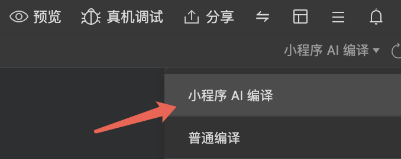
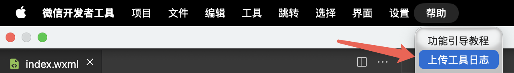
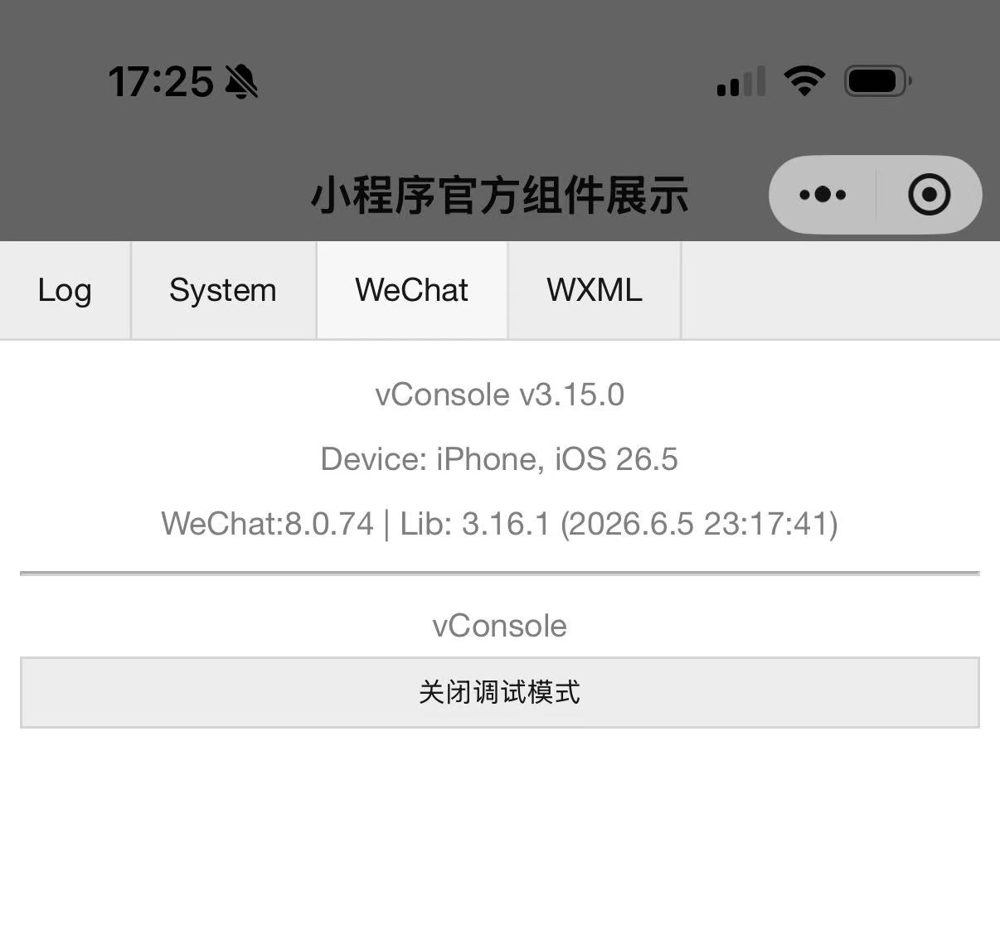
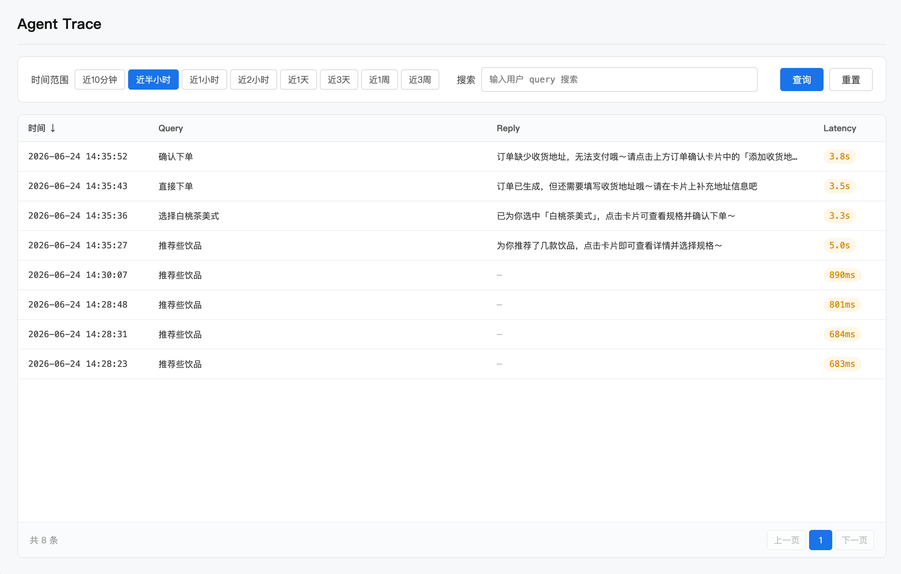
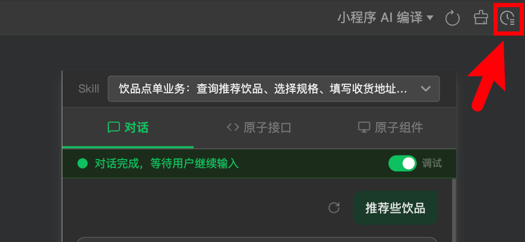
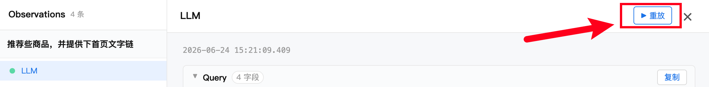

> 源页面：https://developers.weixin.qq.com/miniprogram/dev/ai/debugging.html
> 抓取时间：2026-07-21

# 调试指南

## 一、使用开发者工具

下载安装 微信开发者工具（Nightly Electron Build 最新版本)

在「编译模式」入口切换到「小程序 AI 编译」，调试基础库切到 3.16.2

> 1. 如果进入项目窗口发现看不到 "小程序 AI 编译"，确保在「微信公众平台 - 基础功能 - AI 能力」申请通过了「开发模式」，若已开通，可尝试通过重新登录 / 重新打开项目窗口的方式重试。
> 2. 若流程跑不通，尝试将调试基础库切到其他版本，再切回 3.16.1（触发重新下载资源）

在该编译模式下，支持：

- 对单个 SKILL 调试，可切换 SKILL
- 对单个原子接口调试，可切换原子接口，可手动填入参数
- 对单个原子组件调试，可手动填入参数，可调整组件宽度以适配最小/最大高度
- 完整的对话交互流程，可单步调试，直观地看到原子接口的入参与出参

开发者工具执行异常反馈：帮助 -> 上传工具日志，并提供微信号和复现的时间点

## 二、真机预览与调试

微信客户端支持真机预览体验，需要将微信更新至 8.0.74 及以上（目前仅 iOS 支持），并确保基础库版本是 3.16.1 及以上。

**预览调试**：扫描开发者工具预览的二维码，打开开发版小程序后，在右上角胶囊可以看到「小程序 AI 开发模式」入口，进去即可体验并测试流程，支持胶囊右上角菜单「打开调试」开启 vConsole 进行调试。

> 真机预览调试，非开发者工具上的「真机调试」远程调试功能，该功能暂不支持。

通过以下方法确认基础库版本号：

打开小程序右上角菜单 -> 打开调试 -> 展开 vConsole -> 切至 WeChat 页

**问题反馈**：在开发者社区「小程序 AI 能力」主页发贴反馈问题，为提升问题排查效率，需提供微信号、复现的时间点，并截个屏及上传客户端日志，日志上传入口：微信"我" -> 设置 -> 帮助与反馈 -> 右上角小扳手-> 上传日志 -> 上传最近一小时日志（或在复现时间点附近最小时间范围的日志）

## 三、开发辅助

> SkillHub 专区：微信小程序 AI 开发专区

### 3.1 生成辅助

为了帮助开发者接入，我们将提供一套自动生成与循环验证的系统，核心思路是：基于小程序源码，利用 LLM 自动生成原子接口和原子组件，并通过运行环境验证形成闭环，不断迭代直至达到质量标准。

> 建议一次只生成一小部分业务逻辑对应的原子服务，校验没问题后，再生成其他部分的逻辑。

#### 3.1.1 安装「生成 Skills」

可便捷的基于原有业务代码生成原子接口与原子组件, 可以自由地选择顺手的 Coding Agent（如 CodeBuddy、Claude Code）进行生成，只需要输入 「帮我分析这个项目，接入微信小程序 AI 开发模式」就可以激活「生成 skills」进入生成流程，按照模型的提示，提供信息便可生成对应的原子接口与原子组件。

> 强烈建议生成后用下方「校验 Skills」进行校验，便于发现 Coding Agent 生成的代码的异常问题

- 下载地址：SkillHub ｜ GitHub

#### 3.1.2 安装「校验 Skills」

可基于开发者工具的渲染与执行能力，验证上轮命令中生成的代码，模型会依据真实的运行结果闭环迭代生成原子组件与原子接口（运行过程中开发者工具可能会有对应的授权弹窗，需手动进行授权，未授权可能会导致原子接口执行失败），任务完成后会输出 DELIVERY.md 阐述。

> 在使用「校验 Skills」前，必须在微信开发者工具上进行设置：手动打开工具 -> 设置 -> 安全设置，将服务端口开启。

- 下载地址：SkillHub ｜ GitHub

### 3.2 评测辅助

在基础接入与生成辅助能力之外，开发者实际开发时常会遇到表现不符合预期的问题，且调试成本较高。为此，我们提供了「评测插件」，帮助开发者自动生成评测报告与优化建议，降低排查难度，提升调优效率。当前「评测插件」正在内测中，开发者可下载最新版微信开发者工具使用，详见「AI能力 - 评测指南 」。

## 四、观测平台

该平台用于追踪小程序「开发者」与「体验者」在体验小程序 AI 时产生的对话 Trace，并支持基于 Trace 的重放调试。

### 4.1 打开入口

在「编译模式」入口中切换至「小程序 AI 编译」后，编辑器右上角会显示观测平台入口。

### 4.2 Trace 详情节点说明

Trace 详情中包含以下关键节点：

- **LLM 节点**：记录一次决策（原子接口调用 / 最终回复）所对应的 LLM 推理相关的上下文信息。
- **原子接口调用节点**：记录此次原子接口调用详情，包括 LLM 推理产出的入参，以及接口的执行返回结果。
- **finalReply 节点**：记录本轮对话最终下发给用户的回复内容，包含以下字段：
  - replyContent: 文本回复内容
  - cards：所渲染的原子卡片所关联的原子接口
  - pageLinks：文字链相关

### 4.3 LLM 重放

在 Trace 详情中查看任一 LLM 节点时，可对该节点发起重放。重放面板中可针对本次 LLM 决策所依赖的上下文信息进行修改，包括：

- SKILL 配置
- 原子接口定义
- 文字链页面配置
- 前置已调用工具的返回信息

修改后可查看在新上下文下 LLM 的推理结果，用于辅助定位问题与验证调整效果。

---

*2026 年 06 月 12 日*

*补充 skillhub 下载地址*
