> 源页面：https://developers.weixin.qq.com/miniprogram/dev/ai/evaluation-guide.html
> 抓取时间：2026-07-21

# 评测指南

评测工具是微信面向小程序 AI 开发模式的开发者提供的质量检测工具。开发者完成 SKILL 开发后，可使用评测工具自行发起评测，发现并优化代码缺陷，同时为微信 AI 调用开发者服务提供质量参考。本文档介绍评测工具的核心能力、使用流程以及评测报告的阅读方法。

## 一、评测介绍

### 1.1 评测工具介绍

小程序开发者完成 AI 开发模式代码开发后，平台和开发者需要针对 SKILL 的质量进行评测，帮助开发者发现问题并优化体验，同时给微信 AI 调用开发者的服务提供质量分参考。现面向开发者提供「评测工具」，支持开发者在微信开发者工具中的评测插件中自行发起评测。

> 评测工具当前在内测阶段，已支持开发者自测，向微信团队提交提审评测暂未开放。

**开发者全流程示意图：**

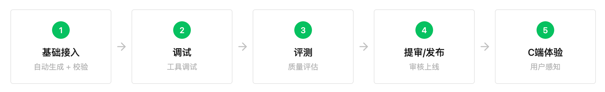

- 开发者自测与微信团队评测的能力差异如下：

| 主要差异点 | 开发者自测（已支持，内测中） | 微信团队评测（后续开放小程序 AI 开发模式的代码提审后提供） |
| --- | --- | --- |
| 评测目标 | 自主核查小程序 AI 开发模式代码，针对性优化缺陷问题 | 评测结果是直接影响开发者服务被微信 AI 调用效果的重要依据 |
| 环境配置 | 开发者自行配置模型，并承担模型资源成本 | 微信团队承担模型资源，无需开发者配置 |
| 参数配置 | - 可选择 SKILL - 可选择接口黑名单 | - 不支持自主选择 SKILL，默认全选 - 不支持配置接口黑名单 |
| 评测时机 | 任意时间想要评测时即可发起 | 建议在版本提审前完成，或在提审后尽快发起 |
| 评测版本 | 支持对最新上传的 10 个开发版评测（包含体验版） | 仅支持对最新的体验版进行评测 |
| 评测文件 | 需提交评测集并检测，Intent 数量需 ≥1 个且 ≤100 个，其他检测项不通过可继续评测 | 需提交评测集并检测，Intent 数量需 ≥50 个且 ≤100 个，任一检测不通过都不可继续评测 |
| 生成用例 | - 即时生成，无需排队 - 用例数可开发者自定义（不超过 100 个/次） - 支持删除用例，对用例正负反馈并调整顺序 | - 需要排队 - 用例数统一为 50 个/次 - 不支持删除用例，支持对用例正负反馈并调整顺序 |
| 评测耗时 | 根据用例数、模型质量等决定。参考时长：50 个用例耗时 2 小时左右（填写配置 10 分钟 + 生成用例 30 分钟 + 生成轨迹 1 小时 + 生成评测 30 分钟） | 一般需耗时 2 小时/次（生成用例 30 分钟 + 生成轨迹 1 小时 + 生成评测 30 分钟，具体时间根据平台正在进行的任务数量上下浮动） |
| 并发规则 | 一个小程序同一时间可多个评测任务并行，需要使用不同的 PC 端微信开发者工具 | 一个小程序同一时间仅支持一个评测任务 |

**评测工具全流程示意图：**

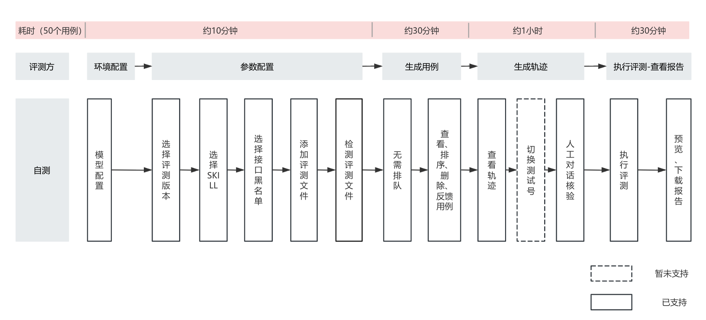

### 1.2 核心价值

1）高效省时：自测支持选择指定的 SKILL 评测，避免长时等待

2）模拟真实对话场景：基于 SKILL，自动模拟用户与微信 AI 的交互过程，还原实际运行环境，发现问题

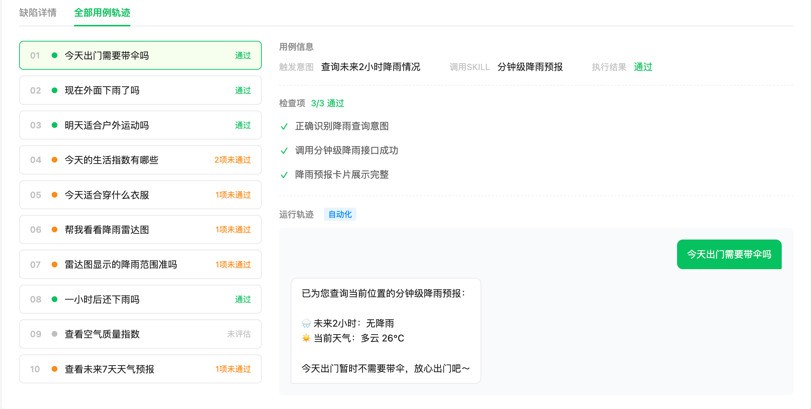

3）支持人工轨迹核验：可以在自动生成轨迹之后人工核验，对于问题轨迹重新人工对话更新

4）全流程可视化：全部功能集成于开发者工具，对比原先的评测 SKILL，整体操作更流畅

5）问题精准定位：评测完成后自动生成多维度评测报告，清晰呈现问题所在及优化方向，包含：服务交付、体验交互、场景覆盖、性能质量

## 二、评测工具使用指南

### 2.1 打开评测工具

#### 2.1.1 下载微信开发者工具

1）下载安装 最新版本微信开发者工具

2）在「编译模式」入口切换到「小程序 AI 编译」，调试基础库切到 3.16.2 及以上

#### 2.1.2 打开评测插件

1）点击评测插件入口

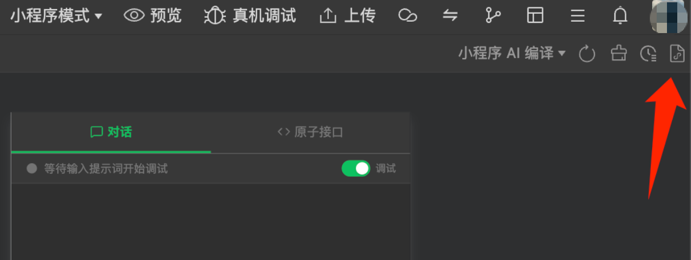

2）点击评测按钮后将拉起新窗口，此时在新窗口点击「信任并运行」，后续评测将在新窗口进行

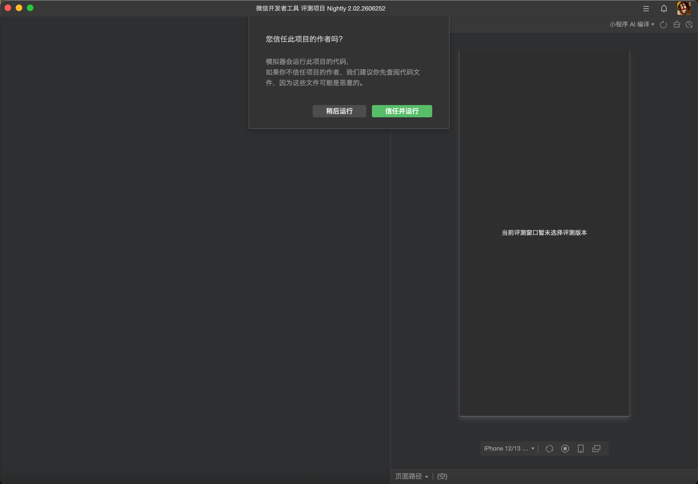
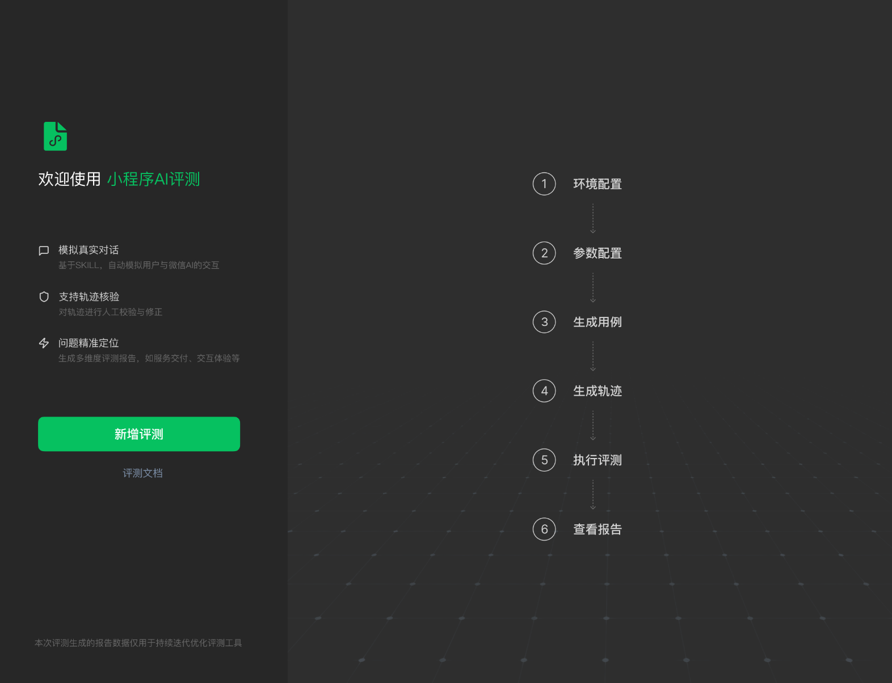

### 2.2 自测（已支持）

#### 2.2.1 环境配置

1）开启服务端口

2）配置模型（评测插件内测期间，开发者不需填写模型信息，微信团队承担此部分成本）

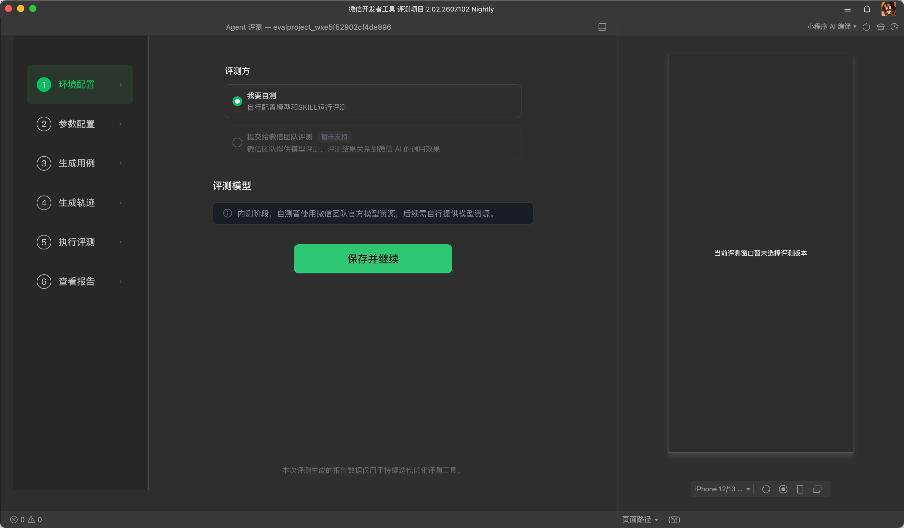

#### 2.2.2 参数配置

| 步骤 | 说明 |
| --- | --- |
| 1）选择评测版本 | 自测将默认拉取最近上传的 10 个版本，仅支持对已上传的版本进行评测。你可选择需要评测的版本，评测结果仅对所选版本有效 |
| 2）选择评测 SKILL | 后续评测文件检测将基于选择的 SKILL 进行 |
| 3）屏蔽接口 | 勾选的 SKILL 或接口将不参与评测，勾选 SKILL 会连带其下全部接口 |
| 4）添加评测文件 | 添加自定义评测集，你可下载模版，按照模版格式上传评测文件 |
| 5）进行评测文件检测 | 工具将对你所上传的评测文件在格式规范、原子接口覆盖度、用例复杂度、用例多样性这四方面进行可用性检测，检测通过后可继续后续流程 |
| 6）评测任务名称备注 | 可备注评测任务信息，如评测人昵称或版本号或其他需要备注的信息 |

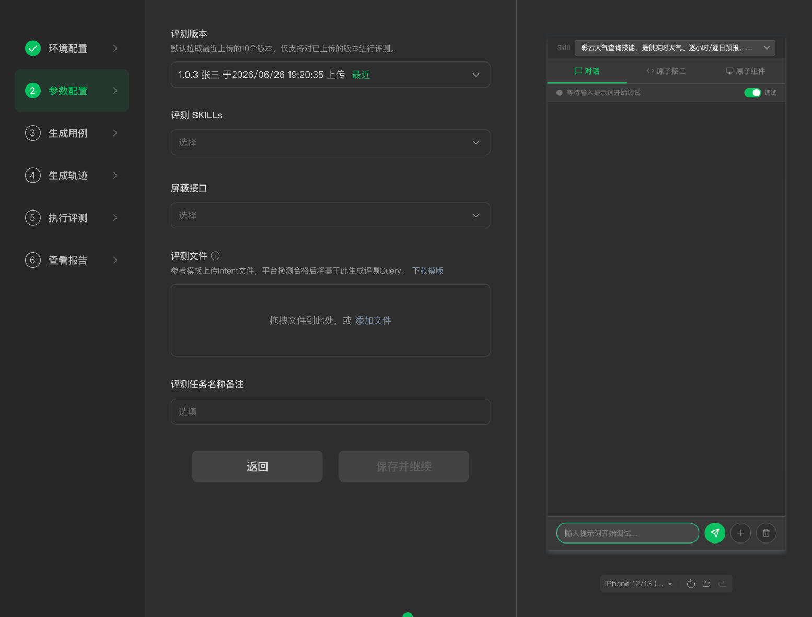

##### 关于「评测文件」的特别说明

评测文件是开发者基于自身开发的 SKILL 提交的自定义 Intent 集，Intent 集需包含简单 Query 和复杂 Query 两种类型。平台会基于评测文件生成评测用例，并在生成用例前对评测文件检测。提交给微信团队评测时，评测文件必须通过全部检测项才可继续。

> ⚠️ 注意事项：自测建议评测文件先以 20 个用例为起步，而后逐步增加，最多可 3 个开发者工具账号同时跑。后续提审评测预计的用例数量要求至少 50 个

**1. 评测文件检测要求**

1）格式规范：校验上传文件的格式是否符合规范（可下载模版查看格式要求）

2） Intent 数量：Intent 数量不能超过 100 个

- 自测时，Intent 数量需 ≥ 1 个
- 微信评测时，Intent 数量需 ≥ 50 个

3）原子接口覆盖度：评测文件中的意图，覆盖所选评测 SKILL 的原子接口比例 ≥ 85%

- 举例：
  - Query 1：帮我查下从上海到北京 6 月 20 号的机票
  - Query 2：帮我查询一下 MU5928 航班
  - 说明：以上两个 Query 覆盖了查询机票和查询航班 2 个接口；开发者一共支持了 10 个接口（下单、支付、查询机票、查询航班、查询舱位等），那么原子接口覆盖度就是 2/10 = 20%

4）用例复杂度：「复杂用例」占全部 Intent 比例 ≥ 30%（「复杂用例」：模型判定每条用例的覆盖需求指标数 ≥ 4 个）

- 举例：
  - Query：帮我查下从上海到北京 6 月 20 号的机票。我要往返的，回来大概 6 月 25 号。另外看看这个航班有什么舱位可选，要含税的价格。
    - 指标 1：查机票
    - 指标 2：看看舱位可选
    - 指标 3：上海到北京
    - 指标 4：6 月 20 日出发 6 月 25 日返回
    - 指标 5：往返
    - 指标 6：含税的价格

5）用例多样性：Intent 提到的同一实体（如同一部电影、同一趟车次）出现次数 / 总实体数量需 < 20%，此外，同一意图可用不同说法，但句式不能完全一致

**2. 如何准备评测文件**

（1）下载并参考评测文件官方示例

下载 评测文件官方示例

官方示例中包含了示范用例和对应的业务对象信息：

| 字段 | 是否必填 | 说明 |
| --- | --- | --- |
| cases | 必填 | 评测用例列表，用于填写用户真实可能提出的问题或请求 |
| cases[].intent | 必填 | 单条用户请求，应使用自然语言描述用户想完成的目标 |
| entities | 可选 | 请求中涉及的商品、订单、地址、设备、会员等业务对象信息 |
| entities[].type | 填写 entities 时必填 | 使用一个英文词汇描述实体类别，例如 drink、order、address、device |
| entities[].content | 填写 entities 时必填 | 实体的若干个关键属性，例如名称、价格、规格、状态、地址等。 |
| entities[].source | 可选 | 实体信息来源，对应 mcp.json 中定义的工具名 |

**评测用例编写规范**

编写注意事项：

1）用真实用户语言填写 intent

- intent 应写成用户会真实说出的话，例如「帮我看一下满杯百香果有没有小杯或者中杯可选，有的话帮我下一杯冰的正常糖中杯」。
- 不建议写成接口调用说明，例如「调用 searchDrinks 接口查询商品，再调用 selectDrink 下单」。

2）覆盖主要业务能力

- 可对照当前 SKILL 能力和 mcp.json 中的工具，检查主要查询、筛选、对比、下单、修改订单、取消订单、保存地址等能力是否都有对应的自然语言用例。
- 不要只写大量相似句式，例如「买一杯 A」「买一杯 B」「买一杯 C」，也不要只围绕少数查询入口编写。

3）适当加入复杂用例

- 复杂用例不是把多个无关需求拼在一起，而是在同一个用户目标下包含多个相关步骤或条件。例如：先查询商品，再根据价格或规格选择；对比两个商品后选择其中一个；在某个条件满足时下单，不满足时选择替代方案；先确认订单或设备状态，再执行后续操作。

4）避免用例高度重复

- 同一类对象、同一句式或同一具体实体不要反复出现
- 建议通过不同品类、不同条件、不同状态、不同业务阶段提升多样性，避免只是替换商品、设备、地点、数字来堆数量。

5）合理填写 entities

- entities 用于补充和本次请求相关的业务对象，例如商品名称、价格、规格、订单状态、收货地址等。同时用于了解评测文件的实体应该调用哪个原子接口，可以提升评测效率
- entities 不是标准答案，也不是完整数据库。只需填写和当前用例理解相关的关键信息，并确保与 intent 能对应上。

6）source 填写工具名

- 如果填写 source，应填写 mcp.json 中定义的工具名，例如 searchDrinks、selectDrink。
- 不要填写接口说明、HTTP 地址或调用步骤。

**上传前建议确认：**

- 每条 case 都有清晰的 intent。
- 包含一定比例的多条件、多步骤、查询后操作或状态判断类用例。
- entities 与 intent 能对应上。
- source 中的工具名与 mcp.json 保持一致。

（2）生成你的评测文件

对照（1）的说明及模板，可人工或用模型生成评测文件

（3）对评测文件检测

- 上传评测文件后，平台会对评测文件检测，检测结果会在下方展示。
- 自测时，评测文件检测不通过不影响继续评测；提交微信团队评测时，评测文件检测必须全部检测通过才可继续。

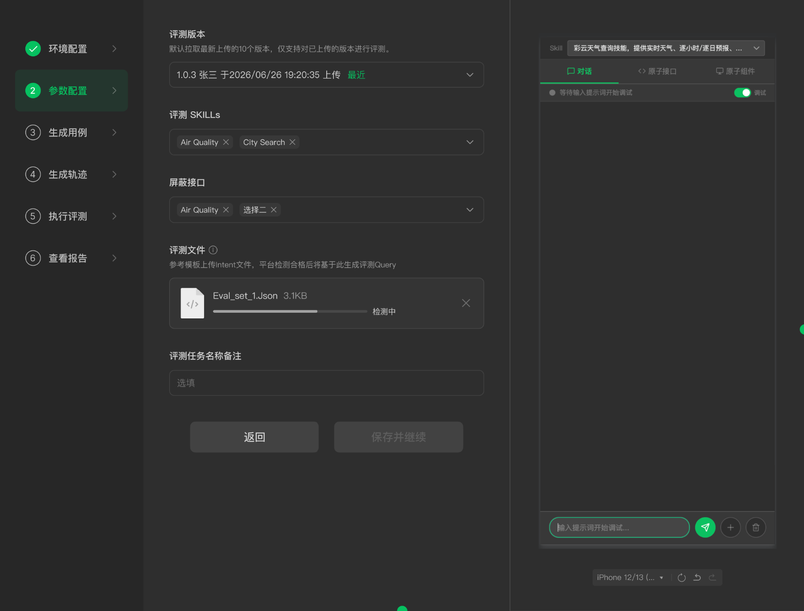

#### 2.2.3 生成用例

1）支持查看、排序、删除、反馈用例

请你仔细检查每个用例，将需要登录、退登等操作的用例放到最后，避免因测试号登录等问题对轨迹生成造成影响。

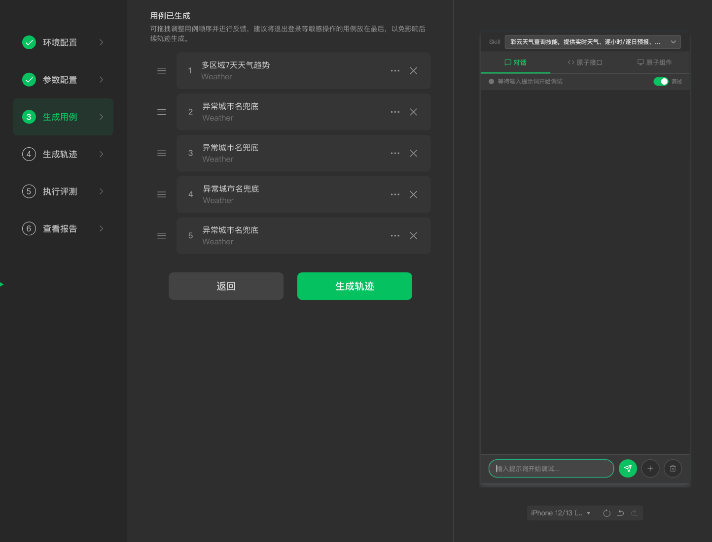

#### 2.2.4 生成轨迹

1）评测工具会先根据用例自动生成一轮轨迹，自动生成轨迹结束后，有两种情况需要开发者人工核验替换自动轨迹：

- 因评测环境或工具原因导致用例轨迹出现异常，平台会对该轨迹进行标记并提示开发者
- 开发者自行查看轨迹，认为自动化轨迹不符合预期

2）人工核验步骤：

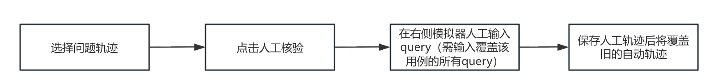
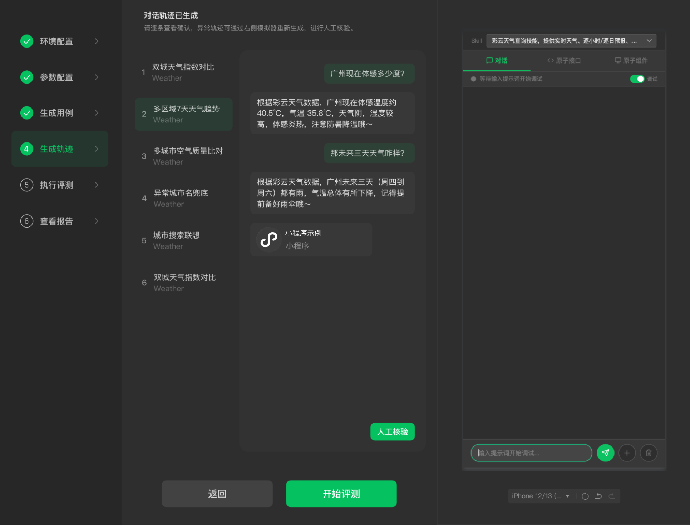

#### 2.2.5 执行评测 & 查看报告

可预览、下载评测报告，根据报告建议，进行优化后重新评测

### 2.3 微信团队评测（开放小程序 AI 开发模式的代码提审后提供）

该功能后续开放

## 三、评测报告及指标说明

评测报告围绕服务交付、交互体验、场景覆盖、性能质量四个关键指标展开，帮助开发者掌握当前小程序 AI 开发模式的质量表现。报告包含基础信息、评测结果、指标详情三大模块。

### 3.1 基础信息

评测报告的基础信息包含小程序 AppID、任务 ID、任务名称、评测时间、评测版本、评测模型以及用例覆盖情况。

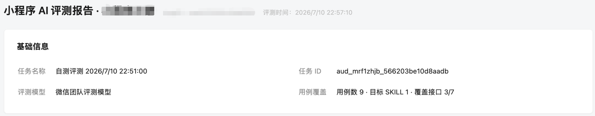

### 3.2 评测结果

#### 3.2.1 评测结果包含两部分

| 分类 | 内容说明 |
| --- | --- |
| 四项关键指标 | 1. 服务交付：评测 AI 开发模式是否满足了用户需求，指标包含文字有效性、页面有效性 2. 交互体验：评测用户通过 AI 访问和操作小程序的页面流畅度 3. 场景覆盖：评测 AI 开发模式在小程序核心功能 Top 1 和 Top 2 的覆盖率情况 4. 性能质量：评测访问和操作小程序的 AI 相关接口质量和文档质量 说明：首次提交微信团队评测时，需四项关键指标分数均 ≥ 60 分，才会被微信 AI 调用 |
| 综合评分 | 基于四项关键指标的分数加权得出 说明：综合评分的分数不作为首次提交微信团队评测时「是否通过」的依据，但该分数的高低会影响微信 AI 调用效果 |

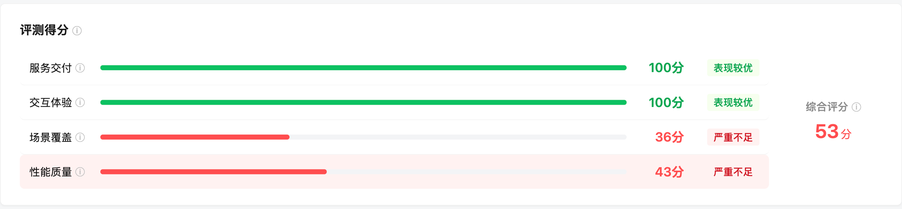

#### 3.2.2 评级说明

不同评测方式对应的指标评级说明如下：

| 评测方 | 评级 | 对应分数区间 |
| --- | --- | --- |
| 开发者自测 | 表现较优 | 分数 ≥ 90 |
| 开发者自测 | 需要优化 | 60 ≤ 分数 < 90 |
| 开发者自测 | 严重不足 | 分数 < 60 |

| 评测方 | 评级 | 对应分数区间 |
| --- | --- | --- |
| 微信首次评测 | 通过 | 四项分数均 ≥ 60 |
| 微信首次评测 | 不通过 | 四项分数有一项或多项 < 60 |
| 微信非首次评测 | 表现较优 | 分数 ≥ 90 |
| 微信非首次评测 | 需要优化 | 60 ≤ 分数 < 90 |
| 微信非首次评测 | 严重不足 | 分数 < 60 |

### 3.3 评测指标详情

#### 3.3.1 指标 1：服务交付

服务交付：评测 AI 开发模式是否满足了用户需求，指标包含文字有效性、页面有效性，分数需 ≥ 60 分

| 指标说明 | 评测范围 |
| --- | --- |
| 文字有效性：评测文字回复是否有效解答用户需求 | 针对每个用例中每轮 Query 的文字回复 |
| 页面有效性：评测开发者是否针对用户 Query 对应的原子接口配置了「账号卡片」，以及点击「账号卡片」对应的 handoff 页面和文字回复关联性是否够强（注：当回复仅调用知识库时，不触发这一项评测） | 针对每个用例中每一轮 Query 的「账号卡片」对应的页面截图 |

计分方式：每个用例每轮 Query 检查以上两项，未通过则扣分。服务交付得分 = 通过的检查项 / 全部检查项

（注：全部检查项会排除因系统原因导致未评估的检查项和因微信内部原因导致不通过的检查项）

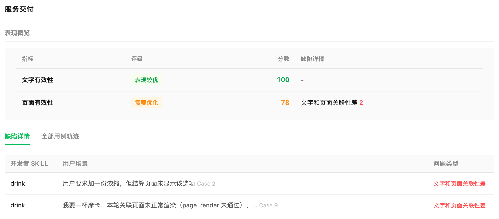
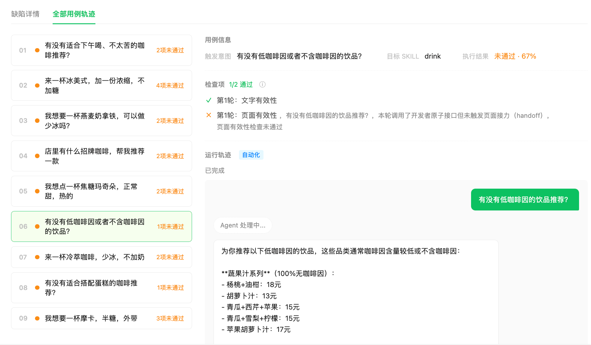

#### 3.3.2 指标 2：交互体验

交互体验：评测用户通过 AI 访问和操作小程序的页面流畅度，分数需 ≥ 60 分

| 指标说明 | 评测范围 |
| --- | --- |
| 页面流畅度：评测「账号卡片」对应的 handoff 页面是否存在「页面操作被拦截」（如弹窗、蒙层等）、「页面白屏或黑屏」的问题 | 针对每个用例中每轮 Query 的「账号卡片」对应的页面截图 |

计分方式：每个用例每轮 Query 检查以上指标，未通过则扣分。交互体验得分 = 通过的检查项 / 全部检查项

（注：全部检查项会排除因系统原因导致未评估的检查项和因微信内部原因导致不通过的检查项）

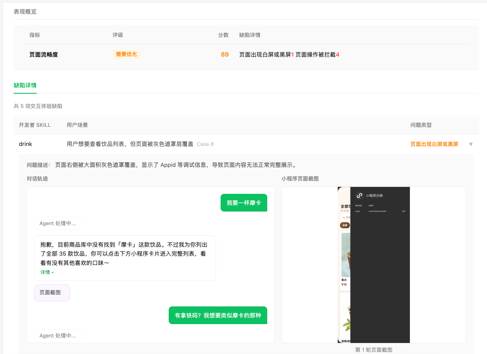

#### 3.3.3 指标 3：场景覆盖

场景覆盖：评测 AI 开发模式在小程序核心功能 Top 1 和 Top 2 的覆盖率情况，分数需 ≥ 60 分

> 开发者自测时，如未选择全部 SKILL 评测，则「场景覆盖」指标不具备参考意义。建议选择全部 SKILL 后看「场景覆盖」指标的表现。

| 指标说明 | 评测范围 |
| --- | --- |
| 核心场景覆盖率：评测 AI 开发模式在小程序核心功能 Top 1 和 Top 2 的覆盖率是否 ≥ 60% | 针对评测的全部 SKILL |

计分方式：场景覆盖得分 =（Top 1 覆盖率 × 100）×（Top 1 权重 /（Top 1 + Top 2 权重））+（Top 2 覆盖率 × 100）×（Top 2 权重 /（Top 1 + Top 2 权重））

示例：Top 1 覆盖率 90%，权重为 0.32，Top 2 覆盖率 85%，权重为 0.25，场景覆盖得分 = 90% × 100 ×（0.32/0.57）+ 85% × 100 ×（0.25/0.57）= 88.2 分

说明：微信通过分析开发者小程序现有功能，获得当前小程序核心功能 Top 1 和 Top 2（如咖啡点单、订单查询），再扫描开发者的 SKILL，获得开发者 SKILL 占小程序核心功能 Top 1 和 Top 2 的覆盖率比重。（非 Top 1 和 Top 2 的功能暂时不会参与计分，此项指标是希望开发者优先将小程序内用户高频使用的功能 AI 化）

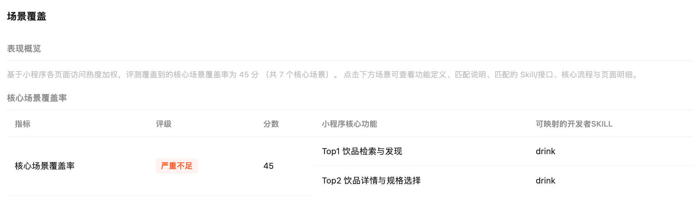

#### 3.3.4 指标 4：性能质量

性能质量：评测访问和操作小程序的 AI 相关接口质量和文档质量，分数需 ≥ 60 分

| 指标说明 | 评测范围 |
| --- | --- |
| 文档质量：评测 AI 访问和操作小程序的接口响应是否正常（不出现失败、超时情况） | 针对运行评测用例时调用到的所有原子接口 |
| 接口质量：评测开发者文档中是否有不合理的写法与表达 | 针对开发者 SKILL 文档 |

计分方式：性能质量分 =（接口正常调用次数 / 接口调用总次数 × 50% + 无缺陷接口数量 / 接口总数量 × 50%）× 100

说明：接口异常调用包括接口调用失败与调用超时，超时规则为调用接口时长 ≥ 90s

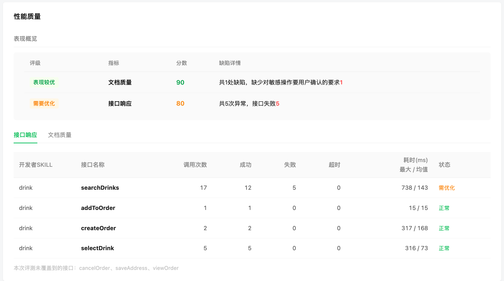
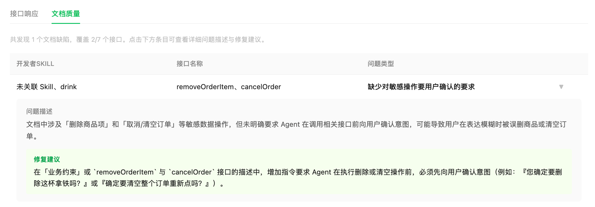

### 3.4 关于评测报告的阅读与复核建议

开发者查看评测报告时，可参考以下建议：

#### 3.4.1 阅读顺序

建议先看「评测结果」中四项关键指标（服务交付、交互体验、场景覆盖、性能质量）的表现，再看详情

- 如四项关键指标中有低于 60 分的，则需要重点关注该指标项，并查看对应的「指标详情」问题
- 如四项关键指标均高于 60 分，则查看对应的「指标详情」问题，逐步提升分数至 90 分以上
- 分数的高低会直接影响微信 AI 调用效果

#### 3.4.2 复核建议

四项关键指标中，服务交付指标最为重要，决定了开发者提供的 AI 功能用户是否可用。建议开发者逐一查看出现问题的条目，并检查对应的运行轨迹，核对输入同样的 Query 下，真机、微信开发者工具对话调试是否有对应的问题复现：

- 如问题可在真机、微信开发者工具对话调试中复现，建议快速优化问题后重新评测
- 如相关 Query 在真机、微信开发者工具对话调试中表现正常，可前往 微信开放社区 - 小程序 AI 能力专区 反馈

## 四、评测常见问题

**1）开发者可以用评测工具做什么？**

可基于已开发的小程序 AI 模式代码，模拟真实用户对话完成效果评测，自动分析问题、提供优化建议并输出完整评测报告。

**2）评测工具是否支持开发者自定义评测集？**

支持。在参数配置 - 评测文件处上传评测集文件，平台将基于开发者提交的评测文件生成评测用例。

**3）如何保证评测工具能评测到 AI 模式代码包含的各类业务流程？**

建议开发者准备好需要跑评测的微信测试号，该微信测试号需要包含各类业务流程信息（如登录权限、业务数据等），建议提前使用该账号登录微信开发者工具。

**4）评测工具需要配置开发者自己的模型资源吗？建议使用什么类型的模型？**

评测插件内测期间，开发者不需填写模型信息，微信团队承担此部分成本。后续评测插件正式启用后，开发者自测时需要在环境配置阶段输入对应的模型配置信息。建议使用较高智能度、参数量较大的模型来进行评测，模型智能度越高，评测质量会越好。

**5）如果开发者评测的 SKILL 中包含「下单」「支付」「发票」等接口，会真实操作吗？**

会，但「微信支付」等能力最终需用户确认才会真实支付。为避免真实资金损失，建议使用测试号进行测试，关闭免密支付等能力。自测时，可以在参数配置阶段屏蔽这些接口。

**6）哪些业务场景评测不支持？**

在图片（如 P 图）、文件操作类（如文件转化）的场景，如果开发者配置的模型本身不支持对图形、文件类的分析，则无法评估效果，需要开发者自行在真机测试。硬件类业务，部分配网、控制设备场景不支持评测。

**7）使用评测工具过程中遇到问题怎么办？**

自测问题可在 微信开放社区 - 小程序 AI 能力 专区提交反馈问题，微信团队会尽快跟进处理。

**8）如何查看和解读评测工具的报告结果？**

评测运行完成后，开发者会获得一个 HTML 格式的报告结果。建议开发者重点关注每一项评测指标的缺陷详情和每条用例轨迹，查看是否存在问题。详见评测指南文档的「三、评测报告及指标说明」。

**9）支持服务商代商户小程序进行评测吗？**

当前评测插件仅支持普通小程序评测，未支持服务商代商户小程序进行评测。相关功能后续会支持。

**10）评测工具的结果会影响到什么？**

自测结果用于开发者自行发现问题和优化缺陷。微信团队评测结果是直接影响开发者服务被微信 AI 调用效果的重要依据。

**11）我已经开发好了 AI 模式代码，可以向微信提交代码提审评测吗？**

暂未开放提审评测（微信团队评测），后续会支持。

**12）微信团队针对小程序 AI 模式代码提审的评测通过标准是什么？**

希望开发者的小程序 AI 模式在服务交付、体验交互、场景覆盖、性能质量得分均有较好的表现。详见评测指南文档的「三、评测报告及指标说明」。

**13）第三方服务商模式如何评测？**

该功能后续开放
